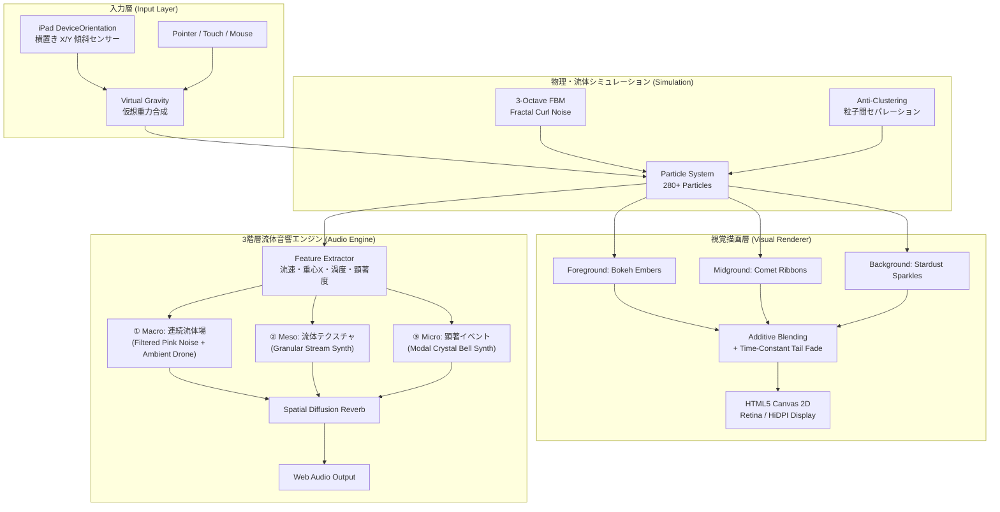

# 音と光のインタラクティブ環境 (Light and Sound Interactive Environment)
## 開発・技術仕様 統合ドキュメント (v0.4)

---

## 1. プロジェクト概要と目的

### 1.1 開発の背景と対象
本システムは、重症心身障害児・多肢不自由児をはじめとする多様な子どもたちが、**「自分の身体の動き（傾きや触覚）が、美しく心地よい光の流れと澄んだ音の響きを生み出す」** という**因果関係（Cause & Effect）**を直感的・身体的・情緒的に実感できるインタラクティブ環境です。

### 1.2 コア体験のデザイン原則
1. **即応性と身体性**: iPadを横置き（Landscape）にして左右に傾けるだけで、光の粒子が生き物のようにダイナミックに滑走・遊泳する。
2. **白飛びのない豊かな色彩美**: 単なる白色発光ではなく、飽和度の高い色彩の光輪と柔らかなパステルコアによる「本物の光」の質感。
3. **耳に優しく調和した音響世界**: 単調なビープ音や電子音の乱発を徹底排除し、水流・風の息吹のような流体ノイズ、光のせせらぎ（Granular音響）、そして水晶ベルの澄み切った余韻（Modal物理合成）が空間を満たす。
4. **静寂とダイナミクスの呼吸**: 静止時や画面端に光が溜まったときは音が極めてゆっくりと静寂へと溶け、動かした瞬間に再び生命が吹き込まれる。

---

## 2. システム全体アーキテクチャ



### 2.1 技術スタック
- **フロントエンド**: HTML5, Canvas 2D Context, Web Audio API (Vanilla JS, 外部ライブラリ非依存のゼロ依存アーキテクチャ)
- **バックエンド / 通信**: Python 3 (`serve_https.py`, `http.server`, `ssl`) によるローカルHTTPSサーバー
- **対応デバイス**: iPad (Safari / iOS 15+ 横置き利用推奨), Mac / Windows / Linux (各種最新ブラウザ)

---

## 3. 視覚描画・流体物理エンジン (`deep-research-report-1.md` 準拠)

### 3.1 3段被写界深度レイヤー (3-Layer Depth of Field)
| レイヤー名 | 構成比 | 役割・表現手法 |
|---|---|---|
| **前景ボケ (Bokeh Embers)** | 約6% | 大きく柔らかなアンビエントオーブ。カメラ直近を漂う幻想的なボケ球を描画。 |
| **主流星 (Comet Streams)** | 約70% | 過去フレームの座標履歴を追跡した先細りカラーリボン（外周コロナ光帯＋内側ビーム＋頭部光球）。 |
| **背景星屑 (Stardust Sparkles)** | 約24% | 細かなきらめき光。高感度で素早く飛び交い、全体の空間に立体的な奥行きを付与。 |

### 3.2 3オクターブ多重 Fractal Curl Noise (FBM)
単純な1層ノイズではなく、スケールと速度の異なる3層のシンプレックスノイズを合成（Fractal Brownian Motion）：
\[
\psi(x, y, t) = \text{noise}(x, y, t) + 0.45 \cdot \text{noise}(2.1x, 2.1y, 1.4t) + 0.20 \cdot \text{noise}(4.3x, 4.3y, 2.1t)
\]
ポテンシャル場 $\psi$ の空間微分からベクトル場 $\vec{v} = (\frac{\partial \psi}{\partial y}, -\frac{\partial \psi}{\partial x})$ を計算し、**完全な非圧縮性（発散ゼロ $\nabla \cdot \vec{v} = 0$）を持つ流体渦** を生成。粒子が1箇所に潰れず、水や煙のように自然に旋回・分離します。

### 3.3 白飛び防止（Anti-Blowout）と色彩テーマ
- **アンチ・ブローアウト設計**: 旧来の純白（`#ffffff`）によるコア・尾引き描画を全廃。彩度70%以上の鮮烈なハロ（主発色層）と、柔らかく色味を帯びたパステル調のコア（ハイライト）を組み合わせ、重なっても色が飛ばず美しいグラデーションを保持。
- **6つの世界観テーマ**:
  1. **Aurora Cosmic**: シアン、サファイア、アメジスト、ゴールド、エメラルドの極光。
  2. **Bioluminescent Ocean**: ネオンアクア、深海ブルー、発光グリーン、クラゲパープル。
  3. **Sakura Twilight**: 桜ピンク、ローズ、マゼンタ、夕暮れゴールド、薄紅。
  4. **Solar Phoenix**: ソーラーゴールド、炎オレンジ、ルビーレッド、琥珀。
  5. **Moonlight Diamond**: ピュアホワイト、クリスタルアイスブルー、シルバーの澄み切った高コントラスト光。
  6. **Neon Cyber**: ネオンピンク、レーザーグリーン、ネオンシアン、エレクトリックイエロー。

### 3.4 会議室・プレゼン用プロジェクター投影最適化 (Projector Optimization)
iPadのLiquid Retina/有機ELディスプレイと比較し、会議室用プレゼンプロジェクター（3000〜4000 ANSIルーメンの3LCD/DLP機）は以下の特性・課題を持ちます：
1. **黒浮きとコントラスト低下**: 純黒（#000000）が投写光や室内環境光で白っぽく浮き、極低アルファ（0.1以下）の淡いグラデーションが濁ったグレーに見える。
2. **パステル調の白飛び・彩度低下**: 白ピーク輝度を強調するプロジェクターのカラーホイール/ランプ特性により、中間色が薄まり白飛びしやすい。
3. **大画面投写時の微細ディテール消失**: 100インチ以上の大画面を数メートル離れて鑑賞する場合、微小な粒子や極細ラインが解像感不足で消失する。

**【本システムでのプロジェクター最適化実装】**:
- **プロジェクター最適化モード (`displayMode: 'projector'`)**:
  - **光粒子・光条スケールブースト**: 基本半径を 1.40倍、光条幅を 1.30倍〜2.60倍に太らせ、大画面投影時でも粒子の存在感を明確に保持。
  - **発色・アルファブースト**: コロナ光帯およびハロの透明度を 1.30倍 強化し、プロジェクターの光に負けない鮮烈な色彩を再現。
  - **残像減衰の床値補正**: キャンバス全体のフェードアルファ下限を調整し、黒浮きしたスクリーン上でも尾引きの輪郭をくっきりと維持。
  - **プロジェクター視認性スケールスライダー**: 部屋の明るさやスクリーンの大きさに応じて 1.0x 〜 2.4x の間でリアルタイム微調整可能。

---

## 4. 3階層流体音響エンジン (`deep-research-report-2.md` 準拠)

### 4.1 「一粒＝一音」の破棄と階層分離
粒子ごとに乱数で単音を鳴らす方式は、マシンガンのようなビープ音になり耳障りです。本システムでは流体場の状態を集約し、**3つの異なる役割を持つレイヤー** へ振り分けます。

```text
流体場の状態 (Global Latent Field)
  ├── ① Macro (連続場) : 速度・傾き連動ノイズ ＋ 和声ドローン（呼吸する低音）
  ├── ② Meso (粒子群)  : 速度・密度に応じた Granular 音粒（光のせせらぎ）
  └── ③ Micro (顕著事象): 高エネルギー瞬間のみ鳴る Modal 結晶ベル（澄んだ余韻）
```

### 4.2 各音響レイヤーの詳細仕様

#### ① Macro Layer: 大局・連続流体場
- **流体ストリーム・ノイズ**:
  - プロシージャル生成されたピンクノイズをバンドパスフィルター（$320\text{Hz} \sim 3100\text{Hz}$）に通し、光の流速に合わせて開閉。
  - 傾けると水流や風の息吹が立ち上がり、静止すると完全消音。
- **動的アンビエント・ハーモニック・ドローン**:
  - ルート（C3=130.81Hz）と5度（G3=196.00Hz）の低域サイン波をローパスフィルター（350Hz）で包み込んだ温かい持続音。
  - **動的呼吸エンベロープ**: 傾きや動きが加わるとゆっくりフェードイン（時定数 $\approx 1.0\text{s}$）。傾きがなくなって静止すると **極めてゆっくり（時定数 $\approx 4.0\text{s}$）静寂へとフェードアウト**。常時鳴りっぱなしを完全に排除。

#### ② Meso Layer: 中局・流体テクスチャ（Granular 合成）
- 粒子の平均速度に応じて 1秒あたり 8〜40個の微小な音粒（Grain: 50〜90ms、Hann窓）をリアルタイム生成。
- 粒子群の重心位置（$X$座標）に追従してステレオ空間を左右に漂う「光のせせらぎ」を表現。

#### ③ Micro Layer: 微局・顕著イベント（Modal 結晶ベル合成）
- **物理モデル振動比率**: チベタンボウルやクリスタルベルの非整数倍音振動モデルを採用：
  - 基本波（1.000倍, 減衰1.20s）
  - 第2倍音（2.756倍, 減衰0.65s）
  - 第3倍音（5.404倍, 減衰0.35s）
- **選択的発音**: 「急加速のピーク」「渦への突入」など視覚的エネルギーの最も高い瞬間のみ厳選して発音（最大同時5ボイス制限）。
- **ペンタトニック調和音階**: 画面Y位置（上が高音、下が低音）に量子化され、不協和音を完全排除。

#### ④ 空間ディフュージョン・リバーブ & 左右端フェード
- プロシージャル・インパルスレスポンス（2.2秒残響、指数減衰）による豊かな残響空間。
- iPadを傾けて粒子が左右の壁面に45%以上溜まると、すべての音響が穏やかにフェードアウトして静まり返り、逆方向に傾けると再び音が立ち上がる。

---

## 5. パラメータ仕様一覧

設定画面（⚙ボタン）からリアルタイムに調整可能なパラメータ群：

| パラメータ名 | 内部キー | デフォルト値 | 調整範囲 | 説明 |
|---|---|---|---|---|
| 色彩テーマ | `colorTheme` | `aurora` | 6種類 | 全粒子パレットのリアルタイム切り替え |
| 入力モード | `inputMode` | `both` | `both`, `tilt`, `pointer` | 傾きとポインターの合成モード |
| 有効な傾斜軸 | `gravityAxes` | `x-only` | `x-only`, `xy` | 左右のみ、または上下左右両方 |
| 傾斜応答感度 | `tiltSensitivity` | `2.2` | 0.5 ～ 4.5 | iPadの傾きに対する加速の強さ |
| 多重渦の強さ | `curlStrength` | `1.4` | 0.0 ～ 3.0 | 流体Curlノイズのうねりの強さ |
| 流体空間スケール | `flowScale` | `1.6` | 0.5 ～ 4.0 | 渦の空間的な大きさ・細かさ |
| 残像寿命 | `trailTau` | `0.65`秒 | 0.15 ～ 2.5 | 尾引き（軌跡）が消えるまでの減衰時間 |
| 光粒子の数 | `particleCount` | `280` | 50 ～ 700 | 画面上の総粒子数 |
| 光粒子の基本サイズ | `particleSize` | `6`px | 3 ～ 18 | 粒子の基本半径 |
| 主音量 | `masterVolume` | `0.6` | 0.0 ～ 1.0 | マスターゲイン出力 |
| 流体音の豊かさ | `streamVolume` | `0.5` | 0.0 ～ 1.0 | 背景水流ノイズ・Granular音・ドローンのゲイン |
| 結晶ベル発音頻度 | `soundDensity` | `0.25` | 0.05 ～ 0.8 | 顕著イベント発生時のベル発音確率・頻度 |
| 音階スケール | `pitchScale` | `pentatonic` | `pentatonic`, `major`, `crystal` | 結晶ベルのピッチ量子化音階 |

---

## 6. iPad実機検証・運用環境

### 6.1 ローカルHTTPSサーバー仕様
iOS Safari のセキュリティ要件（`DeviceOrientationEvent` のアクセス制限）に対応するため、自己署名SSL証明書を用いたHTTPSサーバーを用意：
- **サーバー起動スクリプト**: [`serve_https.py`](file:///Users/toshi/src/lightandsound/serve_https.py)
- **ポート番号**: `8443`
- **アクセスURL**: `https://192.168.50.46:8443/`
- **証明書ファイル**: `cert.pem`, `key.pem`

### 6.2 iPadでの操作手順
1. iPadのSafariで `https://192.168.50.150:8443/` にアクセス（自己署名証明書の警告が出た場合は「詳細」→「Webサイトを閲覧」を選択）。
2. iPadを**横置き（Landscape）** にして持ちます。
3. 画面中央の **「画面に触れてスタート」** をタップ（これによりiOSの傾斜センサー許可・Web Audio・全画面表示が同時にアンロックされます）。
4. iPadを左右に傾けると、傾けた方向へ光の川がダイナミックに流れ、澄んだ結晶音と水流の音がステレオで響きます。
5. 右上の目立たない ⛶ アイコン（全画面切替）または ⚙ アイコン（設定）をタップして、表示や音響の微調整が可能です。

### 6.3 iPadでアドレスバー・ツールバーを完全に消す方法 (PWA Standalone)
iPadOS Safariで上部のアドレスバーやタブバーを完全に消し、**額縁のないネイティブ全画面アプリ** として動作させる手順：
1. iPadのSafariで本システムを開きます。
2. 画面上部右側（または下部）の **「共有ボタン（四角から上矢印 􀈂）」** をタップします。
3. メニュー一覧から **「ホーム画面に追加」** を選択します。
4. ホーム画面に生成されたアイコン「**音と光**」をタップして起動します。
5. SafariのブラウザUIが完全に消滅し、起動直後から100%全画面（`display: fullscreen / standalone`）で起動します。

---

## 7. 文献リファレンス
- **視覚・流体物理知見**: [`deep-research-report-1.md`](file:///Users/toshi/src/lightandsound/deep-research-report-1.md)
  - Bridson et al. *Curl-Noise for Procedural Fluid Flow* (SIGGRAPH 2007)
  - Spencer et al. *Physically-Based Glare Effects for Digital Images* (SIGGRAPH 1995)
- **音響・NIME・知覚知見**: [`deep-research-report-2.md`](file:///Users/toshi/src/lightandsound/deep-research-report-2.md)
  - *residUUm: Multilayered live audiovisual generation* (NIME 2016)
  - Andrew Johnston, *Fluid Simulation as Full Body Audio-Visual Instrument* (NIME 2013)
  - Evans & Treisman, *Natural cross-modal mappings between visual and auditory features*
  - W3C Web Audio API Specification & Tone.js Granular Architecture

---

## 8. 今後の拡張可能性
- **カメラ入力連携 (Vision)**: iPadのインカメラによる身体動作・顔の傾き・手の動きの検出。
- **WebGPU / WebGL レンダラーへの拡張**: 数万〜数十万粒子のさらなる大規模描画。
- **外部MIDI / OSC連携**: 特別支援学校や展示会場の大型スピーカー・外部シンセサイザーとの連携。
