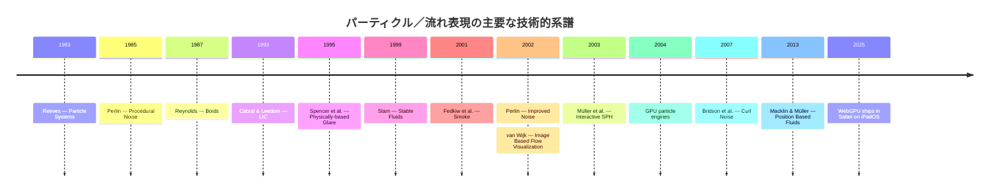
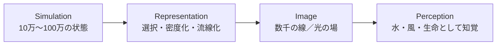
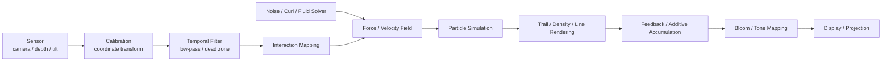
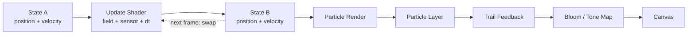
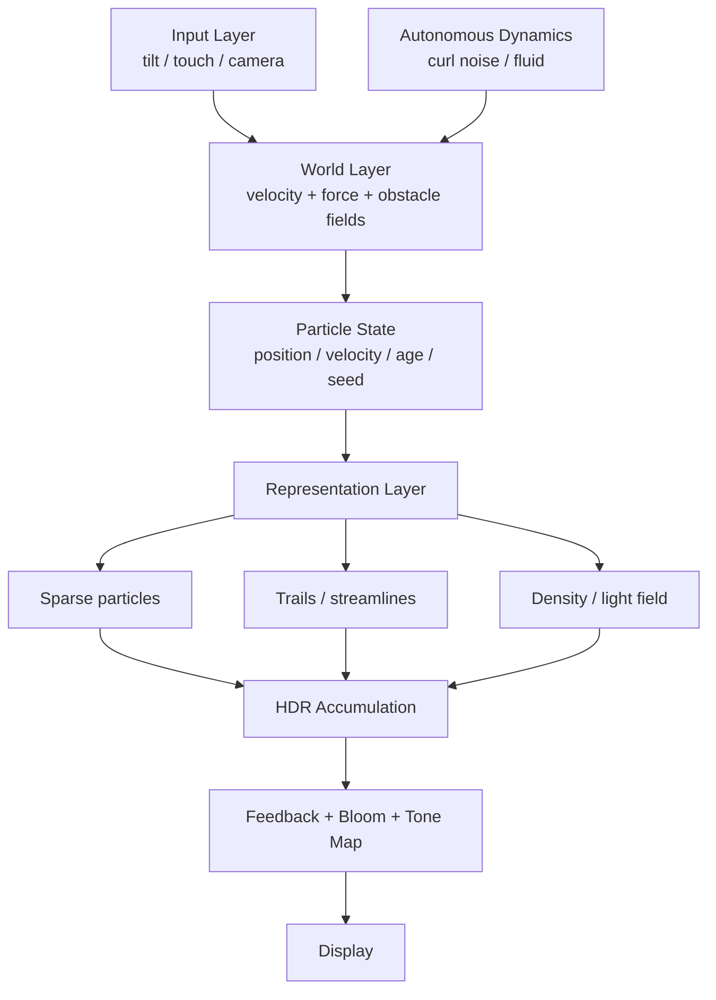

# インスタレーション／インタラクティブアートにおける「美しいパーティクル」の設計知

## エグゼクティブサマリー

インスタレーションで強い魅力を持つパーティクル表現を、SIGGRAPH／Eurographics／ACM／IEEE のコンピュータグラフィックス研究、視覚知覚研究、teamLab、Ryoji Ikeda、Random International、TouchDesigner の実践資料まで横断して調べると、結論はかなり明確です。

**美しいパーティクルは、個々の粒を美しく描くことで生まれるのではなく、粒子群に「空間的・時間的な秩序」を与え、その秩序を軌跡・密度・光として可視化することで生まれます。** Reeves が1983年に導入した particle system は、火・雲・水のような「明確な表面を持たない fuzzy objects」を多数の粒子で表現する考え方でしたが、現在のインタラクティブアートではさらに、粒子を最終的な描画プリミティブそのものではなく、**流れや形を生成する潜在表現**として利用する方向に発展しています。citeturn21search0turn21search32

特に重要なのは次の五点です。

**第一に、良い乱れは独立乱数ではなく「相関した乱れ」です。** Perlin noise は空間的に連続した疑似ランダム構造を提供し、Bridson らの curl noise はそこから発散ゼロの渦状速度場を生成します。これにより、完全に規則的でも完全にランダムでもない、「大きな流れの中に局所的な揺らぎがある」運動を安価に作れます。citeturn23search0turn23search1turn22search12

**第二に、美しさは現在位置より「時間の痕跡」に強く依存します。** 流線、trail、feedback、motion accumulation は粒子の瞬間位置を軌跡へ変換します。流れ可視化研究では、LIC や Image Based Flow Visualization が、ベクトル場を線や時間的に移流するテクスチャへ変換することで、単独の矢印より流れの構造を読みやすくすることを示しました。TouchDesigner の Feedback TOP も、実制作では同じ原理を映像フィードバックとして利用します。citeturn22search1turn22search5turn15search0

**第三に、知覚上の鍵は coherent motion と common fate です。** Williams と Sekuler の random-dot 実験では、多数の局所的な動きから平均方向を持つグローバルな運動が知覚され、Levinthal と Franconeri は「共通運命」によるグルーピングを実験的に調べています。したがって、「全粒子を独立に面白く動かす」より、**共通する大局的運動＋局所差**を作る方が、視覚系がひとまとまりの現象として解釈しやすいと考えられます。ただし、これらの研究が「美しさ」そのものを証明しているわけではなく、支持しているのは運動のまとまり・可読性・知覚的組織化です。citeturn23search2turn23search7

**第四に、粒子シミュレーションと最終描画を分離することが非常に重要です。** teamLab は水を「無数の水の粒子の連続体」として計算し、その挙動から線を描くと説明しています。「渦巻く滝」では、シミュレーション中の水粒子からランダムに選んだ **0.1%** の軌跡だけを線として描いています。すなわち「100万粒子を計算したから100万個の点を描く」という発想ではなく、**多数の潜在粒子 → 選択・集積 → 少数の視覚的ストローク**という構造です。これは美しいパーティクル設計における非常に重要な実践知です。citeturn20view5turn20view6

**第五に、優れたインタラクションは「粒子を直接操作」するより「粒子が生きる世界の法則を変える」傾向があります。** teamLab では人が水流に対する岩のような境界条件になり、Random International の *Rain Room* では身体の存在が局所的に降雨を止め、TouchDesigner の実践では optical flow を velocity field として粒子に伝えます。傾き入力についても「傾き→粒子座標」ではなく、**傾き→重力・流れ方向・乱流強度→粒子群**とする方が、操作対象が「絵」ではなく「世界」になります。citeturn20view5turn20view8turn20view9

本調査から導く、iPad級 WebGL アプリの最も堅実な初期構成は、**WebGL 2 + 256×256 RGBA16F particle-state texture + ping-pong FBO + curl-noise/flow field + 65,536 particles + additive rendering + ping-pong trail buffer + 半解像度 bloom** です。60 fps を目標とし、16.67 ms のフレーム予算を超えたら粒子数より先に bloom／trail 解像度と device pixel ratio を動的に下げます。WebGL 2 は Safari 15 以降 WebKit でサポートされ Metal 上に実装されており、2025年の Safari 26 では WebGPU も iPadOS に正式導入されたため、2026年時点では WebGPU compute を上位パス、WebGL 2 を互換性の高い基準パスとする二段構成も現実的です。citeturn24search0turn24search18turn20view12

## 学術的基盤と知覚

### パーティクル表現の系譜

CG における粒子の歴史は、「個体を精密にモデル化する」発想から、「多数の簡単な要素の集合によって現象を立ち上げる」発想への転換として読むことができます。Reeves の1983年論文は火、雲、水などを粒子の集合として扱い、Reynolds の1987年 *Boids* は逆に、単純な局所ルールから群れ全体の運動を創発させました。1990年代以降は、ベクトル場・流体力学・GPU 計算が加わり、「粒子自体」よりも「粒子を規定する場」の設計が中心になっていきます。citeturn21search0turn21search1turn21search2



この流れで特に参照価値が高い一次資料をまとめると次のようになります。最後の列は論文自身の主張ではなく、本調査におけるインスタレーション設計への読み替えです。

| 一次資料 | 核となる知見 | インスタレーションへの意味 |
|---|---|---|
| Reeves, *Particle Systems—A Technique for Modeling a Class of Fuzzy Objects*, SIGGRAPH 1983 | 境界の曖昧な現象を粒子群でモデル化 | 粒子は形状ではなく「現象」の表現単位になれる citeturn21search0 |
| Perlin, *An Image Synthesizer*, SIGGRAPH 1985 | procedural gradient noise | 独立乱数ではない空間的に連続した変動 citeturn23search0 |
| Reynolds, *Flocks, Herds, and Schools*, SIGGRAPH 1987 | 局所ルールから群れの大局運動を生成 | coherence と individual variation の両立 citeturn21search1 |
| Cabral & Leedom, *Imaging Vector Fields Using LIC*, SIGGRAPH 1993 | ベクトル場を流れに沿った連続パターンへ変換 | 「点」ではなく軌跡／流線を見せる理論的基盤 citeturn22search1 |
| Spencer et al., *Physically-Based Glare Effects for Digital Images*, SIGGRAPH 1995 | 眼内散乱に由来する glare の画像生成 | bloom/glow を単なる装飾でなく光の知覚モデルとして理解できる citeturn22search2 |
| Stam, *Stable Fluids*, SIGGRAPH 1999 | 安定したインタラクティブ流体計算 | 粒子を「流す場」をリアルタイム生成できる citeturn21search2 |
| van Wijk, *Image Based Flow Visualization*, SIGGRAPH 2002 | テクスチャの移流と減衰による時変流れ可視化 | feedback + advection の理論的先祖 citeturn22search5 |
| Perlin, *Improving Noise*, SIGGRAPH 2002 | gradient noise の改良 | flow field の基礎関数として実装しやすい citeturn23search1 |
| Müller et al., *Particle-Based Fluid Simulation for Interactive Applications*, SCA 2003 | SPH による自由表面流体 | 粒子そのものに液体的相互作用を持たせる citeturn21search3 |
| Kipfer et al., *UberFlow*, SCA 2004 | 大量粒子の GPU 計算・描画 | CPU を介さない大量粒子システムの系譜 citeturn22search19 |
| Bridson et al., *Curl-Noise for Procedural Fluid Flow*, SIGGRAPH 2007 | ノイズから厳密に非圧縮な速度場を生成 | 安価なのに流体らしい渦を作る有力な「美的近似」 citeturn22search12 |
| Macklin & Müller, *Position Based Fluids*, SIGGRAPH 2013 | PBD 内で密度制約を反復解法化 | 安定性を重視したインタラクティブ液体 citeturn24search3 |

ここで重要なのは、**物理的リアリズムと視覚的説得力を分けること**です。Stable Fluids や SPH は物理モデルに近い側にありますが、curl noise は「流体方程式を解く」のではなく、数学的性質のよい人工速度場を生成します。それでも渦・巻き込み・流線の連続性が保たれるため、作品制作ではしばしば十分に「流体らしい」。したがって、芸術用途では「Navier–Stokes をどこまで正確に解くか」より、**どの視覚的性質に計算資源を配分するか**が本質的です。citeturn21search2turn21search3turn22search12

### 「時間的コヒーレンス」は何をもたらすか

Williams と Sekuler の random-dot 研究では、各点の動きにランダム性があっても、方向分布に一定のまとまりがあるとグローバルな運動が知覚されます。さらに common-fate grouping の研究は、「同じ方向へ動く」こと自体が、空間的に離れた要素をひとまとまりとして知覚させる強い手掛かりになることを示しています。citeturn23search2turn23search7

したがって、作品上の「有機的な美しさ」を

\[
\mathbf v_i(t)=\mathbf V(\mathbf x_i,t)+\epsilon_i(t)
\]

と考えるのが有用です。ここで \(\mathbf V\) は群れ全体に共有される滑らかな速度場、\(\epsilon_i\) は個別差です。**全粒子が同一なら硬直し、\(\epsilon_i\) が支配的ならまとまりを失う。** 美的な最適比率が心理物理学から一意に得られるわけではありませんが、「共有運動と個体差を別パラメータとして持つ」ことには知覚研究上の根拠があります。citeturn23search2turn23search7

さらに流れ可視化研究では、単発の glyph より、流線や時間的に連続したテクスチャによって速度場の構造を見せる方法が発展しました。Image Based Flow Visualization は、画像を流れに沿って移流・減衰させることで時間的な連続感を生成します。これは現在のジェネラティブアートでいう「feedback buffer を少しずつ消しながら変形する」という技法と構造的にほぼ同じです。citeturn22search1turn22search5

### 光の蓄積は「密度を見せる」

加算合成は、単に派手な glow を作るだけではありません。粒子が重なる場所ほど RGB の寄与が増えるので、局所粒子密度や滞在時間を明るさへ暗黙に写像できます。この上に bloom/glare を掛けると、高エネルギー領域が周囲へ光を広げます。Spencer らの SIGGRAPH 1995 論文は、人間の眼内での散乱に由来する glare を画像生成として扱っており、現代の bloom の視覚的説得力を理解する重要な基礎資料です。citeturn22search2

したがって、「粒子を明るくする」のではなく、

\[
\rho(\mathbf x)=\sum_i K(\mathbf x-\mathbf x_i)
\]

\[
L(\mathbf x)=1-\exp(-k\rho(\mathbf x))
\]

のように、**密度 \(\rho\) から輝度 \(L\) を作る**と考えると設計しやすくなります。実装上は explicit な density texture を作らなくても、soft particle sprite を additive blend するだけで近い働きを得られます。WebGL で HDR の浮動小数点 render target を使う場合、`EXT_color_buffer_float` は R16F/RG16F/RGBA16F および32-bit float 系を color-renderable にしますが、32-bit float target への blending には `EXT_float_blend` の対応確認が必要です。citeturn20view11turn24search1

## アルゴリズムの比較と選択

### Flow field、Perlin、Simplex、curl noise

インスタレーション用途で最も「費用対効果」がよいのは、**粒子ごとに複雑な相互作用をさせず、空間に速度場を置く方法**です。

もっとも単純な noise flow field は、

```glsl
float n = noise(vec3(p * fieldScale, time * temporalScale));
float theta = n * 6.28318530718;
vec2 field = vec2(cos(theta), sin(theta));

velocity += field * force * dt;
velocity *= exp(-damping * dt);
position += velocity * dt;
```

と書けます。Perlin の1985年および2002年の noise は、このような「空間的に滑らかな疑似乱数場」の基盤となりました。Simplex noise は実制作・shader 実装ではよく使われ、TouchDesigner の Noise TOP にも Perlin 系と Simplex 系が実装されていますが、歴史的な一次研究資料としては Perlin の SIGGRAPH 論文ほど明瞭ではないため、本報告では **noise 一般の学術的基盤は Perlin、Simplex は実装上の派生選択肢**として位置付けます。citeturn23search0turn23search1turn15search24

さらに有力なのが curl noise です。2次元ならスカラー potential \(\psi\) から

\[
\mathbf u =
\left(
\frac{\partial\psi}{\partial y},
-\frac{\partial\psi}{\partial x}
\right)
\]

とすれば、

\[
\nabla\cdot\mathbf u=0
\]

となり、湧き出し／吸い込みがない非圧縮な2D速度場になります。Bridson らの方法は Perlin noise を potential として利用し、効率的な乱流状 velocity field を生成します。citeturn22search12turn22search28

GPU では有限差分で十分です。

```glsl
vec2 curlField(vec2 p, float t) {
    float e = 0.002;

    float dx =
        noise(vec3(p.x + e, p.y, t)) -
        noise(vec3(p.x - e, p.y, t));

    float dy =
        noise(vec3(p.x, p.y + e, t)) -
        noise(vec3(p.x, p.y - e, t));

    dx /= 2.0 * e;
    dy /= 2.0 * e;

    return normalize(vec2(dy, -dx) + 1e-6);
}
```

単純 noise angle field に比べて noise 評価回数は増えますが、「渦巻いて流れるが局所的に膨張・収縮しにくい」という性質が、水・煙・星雲・光の糸の表現によく合います。ここでの「美しい」は論文の評価尺度ではなく、**物理的に意味のある制約が、視覚的な流線の一貫性を生む**という制作上の推論です。citeturn22search12

### Boids

Reynolds の boids は、各個体におおむね separation、alignment、cohesion に対応する局所的な振る舞いを与え、群れ全体の複雑な運動を生じさせる方法です。重要なのは中央コントローラが群れをアニメーションしているのではなく、**各個体の局所ルールから集団運動が現れる**点です。citeturn21search1turn21search9

芸術用途では純粋な boids より、

\[
F_i =
w_fF_\text{flow}
+w_aF_\text{alignment}
+w_cF_\text{cohesion}
+w_sF_\text{separation}
+w_nF_\text{noise}
\]

のように flow field と混ぜると扱いやすくなります。大局形状は \(F_\text{flow}\) が保障し、boids 項は局所的な「生命らしさ」を加える役割になります。

難点は neighbour search です。全粒子の全組合せを見る naive 実装は \(O(N^2)\) なので、大量粒子には spatial grid／hash が必要です。このため**数万～数十万の純粋な光粒子を動かす用途なら curl-noise field の方が容易で、数千～数万程度の「個体らしさ」を見せたい場合に boids が有利**というのが実装上の判断になります。これは計算量から導く設計上の推奨であり、特定GPUで保証される粒子数ではありません。citeturn21search1turn22search19

### Eulerian Navier–Stokes と Lagrangian 粒子

流体表現では、二つの考え方を区別すると整理しやすくなります。

**Eulerian 法**は固定格子上に速度・圧力・密度などを保持します。Stam の Stable Fluids はこの系統で、速度場をグリッドとして解くため、「画面のこの位置では流れがこちらを向く」という field が直接得られます。大きな流れ・煙・風を作り、その上に美術用粒子を advect する用途に非常に向きます。citeturn21search2

**Lagrangian 法**は粒子が物質と一緒に移動します。Müller らの SPH は粒子近傍から密度などを推定し、自由表面の液体をインタラクティブに扱います。水滴・しぶき・粘性のある液体など、「粒子自体が物質」である必要があるときに有利です。citeturn21search3

SPH の密度推定は典型的には、

\[
\rho_i=\sum_j m_j W(\lVert \mathbf x_i-\mathbf x_j\rVert,h)
\]

のような近傍 kernel 和になります。したがって noise-flow のような \(O(N)\) に近い更新より、近傍探索の負担が大きくなります。Müller らの研究はこの手法を自由表面流体のインタラクティブシミュレーションへ適用しました。citeturn21search3

Stable Fluids の典型的な処理構造は概念的には、

```text
外力を加える
   ↓
速度を移流する
   ↓
圧力を解く
   ↓
速度を divergence-free に投影
   ↓
density / dye を移流
   ↓
必要なら粒子を velocity field に沿って移動
```

となります。Stable Fluids の大きな功績は大きな time step でも不安定になりにくいことですが、数値散逸によって小さな渦が失われやすいというトレードオフがあります。そのため芸術用途では「低解像度 Stable Fluids で大局運動＋curl noise で細部」というハイブリッドが合理的です。citeturn21search2turn22search12

### Hybrid PIC/FLIP と Position Based Fluids

PIC/FLIP 系は particle と grid を行き来し、Lagrangian と Eulerian の長所を組み合わせます。Zhu と Bridson の SIGGRAPH 2005 の sand simulation は graphics における particle-grid hybrid の重要な例で、この系統は高品質流体でも広く利用されてきました。citeturn11search2turn11search8

Position Based Fluids は、密度制約を PBD の反復 solver に組み込み、リアルタイム性と安定性を狙った手法です。リアルな液体そのものを作品の主役にするなら SPH/PBF/PIC-FLIP を検討する価値がありますが、**光の流れや星屑のような抽象粒子なら、これらはしばしば過剰**です。citeturn24search3

総合すると次のようになります。

| 手法 | 見た目の性質 | 計算負荷 | 長所 | 弱点 | インスタレーション適性 |
|---|---|---:|---|---|---|
| Ballistic particles | 放射、落下、噴出 | 低 | 非常に大量化しやすい | 単調になりやすい | ★★★ |
| Perlin/Simplex flow | 滑らかな有機流動 | 低 | 美的効果／計算量比が高い | 非物理的 | ★★★★★ citeturn23search0turn23search1 |
| Curl noise | 渦状、非圧縮的 | 低～中 | 流体らしい軌道 | noise sampling が多い | ★★★★★ citeturn22search12 |
| Boids | 群れ、生物感 | 中～高 | 創発的、個体感がある | neighbour search | ★★★★ citeturn21search1 |
| Stable Fluids | 煙・風・大局的流れ | 中 | インタラクティブな場を作りやすい | 格子解像度・pressure solve | ★★★★★ citeturn21search2 |
| SPH | 水滴、液体、自由表面 | 高 | 粒子と物質が一致 | 近傍探索が重い | ★★★ citeturn21search3 |
| PBF | 安定した液体 | 高 | 大きめ time step に強い | 実装複雑度 | ★★★ citeturn24search3 |
| PIC/FLIP | 高品質な液体 | 高 | particle/grid 両方を利用 | Web実装には重い | ★★～★★★ citeturn11search2 |
| Image feedback/advection | 霧、流線、残像 | 画素数依存 | 粒子数なしでも豊かな流れ | feedback artifact | ★★★★★ citeturn22search5turn15search0 |

**抽象的な美しいパーティクルを作る第一候補は curl noise、第二候補は low-resolution Eulerian fluid + particles、液体そのものが主題なら SPH/PBF**、というのが本調査からの推奨です。

## インスタレーション実践から得られる設計知

### teamLab — 「粒を描く」のではなく「粒から線を生む」

teamLab の「人々のための岩に憑依する滝」は非常に重要なケースです。公式説明では、仮想空間上に岩を3次元で再現し、水を「無数の水の粒子の連続体」として扱い、粒子間の相互作用を計算し、その粒子の挙動から線を描いています。さらに人が作品に接すると、その人も水流へ影響を与える存在になります。citeturn20view5

[teamLab「人々のための岩に憑依する滝」公式作品ページ](https://www.teamlab.art/jp/ew/iwa-waterparticles/borderless-odaiba/) citeturn20view5

より示唆的なのが「渦巻く滝」です。teamLab は、水粒子のうちランダムに選択した **0.1%** の軌跡を線として描くと説明しています。つまり、simulation state と visible state を意図的に大きく分離しています。citeturn20view6

これは実装上、次の三層へ一般化できます。



この設計の利点は、**計算しているものをそのまま見せなくてよい**ことです。たとえば65,536粒子を GPU 上で流しながら、画面には「速度が高い粒だけ」「曲率が大きい粒だけ」「1/16だけ」「局所密度が閾値を超えた部分だけ」を描くことができます。これにより、粒子数増加＝視覚的 clutter という問題を避けられます。teamLab の0.1%選択は、その考え方の強い実践例です。citeturn20view6

### Ryoji Ikeda — 有機性とは反対側の美しさ

Ryoji Ikeda はパーティクルアーティストという分類ではありませんが、この問題を考える上で重要な反例です。YCAM の *test pattern [nº1]* は、音をリアルタイムに秩序だった白黒パターンへ変換し、暗室内の8モニタ・16スピーカーを通じて厳密に同期させ、YCAM の説明では数百フレーム／秒に達する変化を用いて再生装置と人間の知覚能力を「テスト」します。citeturn20view7

[YCAM「test pattern [nº1]」作品アーカイブ](https://www.ycam.jp/en/archive/works/test-pattern/) citeturn20view7

ここから得られる重要な教訓は、**美しさ＝自然らしい乱流ではない**ということです。Ikeda の作品はむしろ、

\[
\text{厳密な制約}
+\text{高コントラスト}
+\text{空間スケール}
+\text{音映像同期}
+\text{知覚限界への接近}
\]

によって強度を生みます。したがってパーティクル作品でも、常に turbulence を増やすのではなく、「一定時間だけ完全に整列する」「音の拍で全粒子の速度場が瞬間的に量子化される」といった**秩序相への遷移**を入れると、乱流とのコントラストが生まれます。これは Ikeda の作品から導く制作上の推論です。citeturn20view7

### Random International — 「入力」ではなく環境の法則を変える

*Rain Room* では、連続する降雨の中を人が歩くと、身体の存在する部分だけ雨が止まります。Random International 自身は、これを訪問者と作品、人と機械との直感的関係を生むものとして説明しています。citeturn20view8

[Random International「Rain Room」公式作品ページ](https://www.random-international.com/rain-room) citeturn20view8

ここで興味深いのは、

```text
人が手を挙げる → エフェクト発火
```

ではなく、

```text
人が存在する
      ↓
局所的な世界法則が変化する
      ↓
本来降るはずだった雨が降らない
```

という因果構造です。teamLab の「人が水流に対する岩になる」構造と共通しています。citeturn20view5turn20view8

したがってインタラクティブ・パーティクルでも、

> 「触ったら粒が出る」

より、

> 「身体の周りだけ流れ場が曲がる」  
> 「身体が渦度を生む」  
> 「傾けると仮想重力の方向が変わる」

方が、世界の一貫性を保ちやすくなります。これは teamLab と Random International の事例から導く一般化です。citeturn20view5turn20view8

### TouchDesigner — feedback と field の実制作パターン

Derivative の TouchDesigner は、この種の作品の practice-based knowledge がよく可視化されている環境です。公式 Feedback TOP は過去フレームを再利用する feedback effect に用いられ、GLSL TOP は shader ベースの画像／計算処理を可能にします。citeturn15search0turn15search1

特に Derivative Community の *Video Motion Controlled Particles* は、**optical-flow feedback と particle system を結合し、position と velocity の両方を TOP feedback loop で保持する**構成を明示しています。これは WebGL の ping-pong FBO とほぼ同じ設計概念です。citeturn20view9

[TouchDesigner Community「Video Motion Controlled Particles」](https://derivative.ca/community-post/tutorial/video-motion-controlled-particles/70171) citeturn20view9

実践知をまとめると、強い作品では次のような「描画上の二次現象」が多用されます。

| 技法 | 実際に何を表現しているか | 主な効果 | リスク |
|---|---|---|---|
| Trail | 過去位置 | 速度・方向・時間 | 長すぎると泥状になる citeturn22search5turn15search0 |
| Feedback | 過去画像 | 記憶・連続性・自己干渉 | numerical/image feedback artifact citeturn15search0 |
| Additive blending | 光寄与の和 | 密度を輝度へ変換 | 白飛び |
| Bloom/glare | 高輝度の周辺拡散 | 発光感・スケール感 | 全域に掛けると輪郭消失 citeturn22search2 |
| Streamline | velocity field の積分軌跡 | 場の方向性を可視化 | 長すぎると絡まり過ぎる citeturn22search1 |
| Density-to-light | 局所粒子密度 | 群れの中心・流路を強調 | saturation |
| Sparse selection | simulation の一部だけ表示 | 複雑性を保ち clutter を減らす | 少なすぎると構造が消える citeturn20view6 |

特に重要なのは **trail と feedback を同一視しない**ことです。Trail は各粒子の履歴を明示的に保持して line strip を描く方法もありますが、feedback は画像全体の過去フレームを減衰させる方法で、粒子ごとの履歴データを必要としません。モバイル WebGL では後者の方が圧倒的に安価になる場合があります。

## インタラクション設計とパラメータ空間

### センサー値を座標ではなく field parameter へ写像する

インタラクティブ作品で最も有効な一般原則は、

\[
\text{sensor}\rightarrow\text{world model}\rightarrow\text{particles}
\]

とすることです。直接

\[
\text{sensor}\rightarrow\text{particle position}
\]

へ結ばない方が、入力ノイズが作品の視覚文法を壊しにくくなります。teamLab の境界条件型インタラクション、Rain Room の局所環境変化、TouchDesigner の optical-flow velocity feedback はいずれも前者のパターンとして解釈できます。citeturn20view5turn20view8turn20view9



### Optical flow

camera optical flow は、身体の動きを「力のベクトル場」に変換するのに非常に適しています。TouchDesigner の Optical Flow TOP は画像内の動きをベクトルとして検出し、前述の community example はその field を粒子の位置・速度 feedback と結びつけています。citeturn4search26turn20view9

単純化すると、

\[
F(\mathbf x)=
w_nF_\text{curl}(\mathbf x,t)
+w_oF_\text{opticalFlow}(\mathbf x,t)
\]

です。

ここで \(w_o=1\) にして camera motion へ完全追従させるより、通常は **自然に存在している場へ人間の動きを摂動として足す**方が、誰も触っていない時間にも作品が自律して見えます。これはインスタレーションで重要な性質です。

### Depth sensor

depth camera が使える専用インスタレーションでは、人の silhouette を particle emitter にするより、**obstacle／signed-distance field／repulsor** に変換するのが有効です。

たとえば silhouette の signed distance \(d(\mathbf x)\) から、

\[
F_\text{body}=-k\nabla d
\]

を作れば身体表面に沿って粒子を回り込ませられます。さらに身体の移動速度から tangential force を加えると、人が水を掻くような表現になります。これは teamLab の「人が岩のように水流へ干渉する」という作品構造とよく対応します。citeturn20view5

一方、通常のブラウザ標準 API だけを前提とした iPad Web アプリでは、専用 depth センサーデータへの直接アクセスを基準設計にするべきではありません。Web 版は RGB camera／Device Orientation and Motion、専用展示版は TouchDesigner/native bridge + depth camera、と分離する方が堅実です。Device Orientation and Motion の W3C 仕様は、端末姿勢・運動の high-level event を Web アプリに提供します。citeturn20view13

### iPad の傾き

W3C の Device Orientation and Motion 仕様では、姿勢はデバイス座標系に対する回転として提供され、情報源としてジャイロ・コンパス・加速度計などが想定されています。ただしこれは raw sensor API ではなく high-level な orientation/motion 情報です。citeturn20view13

パーティクルへの良い写像は例えば、

```text
端末の静的な傾き
     → global gravity / mean flow direction

端末を素早く傾けた量
     → turbulence / vortex impulse

傾きを保持
     → 徐々に粒子が片側へ集積

水平へ戻す
     → 元の autonomous field が再び支配
```

です。

数式では、

\[
F =
w_g F_\text{tilt}
+w_c F_\text{curl}
+w_i F_\text{interaction}
\]

とし、傾きに低域フィルタを掛けます。

```js
filteredTilt += (rawTilt - filteredTilt)
              * (1 - Math.exp(-dt / tau));
```

ここで `tau` を 80–180 ms 程度から探索すると、センサーの細かい揺れを抑えつつ応答感を残しやすくなります。この数値は規格値ではなく、本報告で推奨するチューニング開始点です。端末の portrait／landscape に応じて座標変換する必要があることも、姿勢を画面座標に変換する上で重要です。W3C 仕様自身は姿勢の座標系と回転を定義しますが、作品側の写像はアプリケーション責任です。citeturn20view13

### 「美」を探索する UI は物理パラメータだけでは足りない

調査した研究・実践を総合すると、UI に出すべきパラメータは `gravity`, `speed`, `particleCount` だけではありません。むしろ「知覚／美的パラメータ」と「計算パラメータ」を分けた方が作品設計に役立ちます。

| UI上の概念 | 内部パラメータ例 | 見え方 |
|---|---|---|
| **Coherence / まとまり** | global field と individual noise の比 | 群れとして読める度合い citeturn23search2turn23search7 |
| **Turbulence / 乱れ** | curl amplitude, octave count | 静穏 ↔ 激しい渦 |
| **Flow scale** | noise spatial frequency | 大きな河川状 ↔ 細かな渦 |
| **Temporal scale** | noise time frequency | ゆったり ↔ せわしない |
| **Inertia** | velocity damping | 空気的 ↔ 重い物質 |
| **Persistence** | trail decay half-life | 点 ↔ 長い光跡 |
| **Density** | particle count / emission | 疎 ↔ 群体 |
| **Light accumulation** | additive gain | 粒 ↔ 発光する流路 |
| **Bloom** | threshold / radius | シャープ ↔ 光芒 |
| **Interaction gain** | sensor-field coupling | 自律的 ↔ 身体追従 |
| **Selection sparsity** | visible simulation fraction | 粒の雲 ↔ 書画的な線 |

特に trail の値は「1フレームあたり0.96」のように定義せず、**秒単位の decay time** にした方がよいです。フレームレートが変わっても見た目を維持できるからです。

\[
a=\exp(-\Delta t/\tau)
\]

```glsl
trail = previousTrail * exp(-dt / trailTau)
      + newParticles * particleGain;
```

これなら30 fps と60 fps で残像寿命が大きく変わりません。

「秩序70%、乱れ30%」のような固定比率に学術的根拠はありません。より厳密には、**coherence と stochastic variation を独立軸にし、作品・画面サイズ・観察距離・インタラクション条件ごとに探索すべき**です。知覚研究から言えるのは、共有運動がグルーピングの強い手掛かりになるというところまでです。citeturn23search2turn23search7

## WebGL／GPU 実装アーキテクチャ

### 基本構成は「one particle = one texel」

GPU パーティクルの歴史では、2000年代前半から particle state を GPU memory に置いて計算・描画する方式が研究され、*UberFlow* などは大きな particle set のリアルタイム GPU animation/rendering を扱いました。現代 WebGL でも本質は同じで、CPU の JavaScript 配列を毎フレーム更新するのではなく、**particle state を GPU 側へ常駐させる**のが重要です。citeturn22search19

WebGL 2 は OpenGL ES 3.0 に近い API を HTML canvas に提供します。浮動小数点状態を framebuffer に書き込むには、端末起動時に `EXT_color_buffer_float` などの capability を必ず確認します。同 extension があれば R16F、RG16F、RGBA16F、R32F、RG32F、RGBA32F 等を render target にできます。citeturn20view10turn20view11

典型的には、

```text
positionTexture RGBA16F
  R = x
  G = y
  B = age
  A = seed

velocityTexture RGBA16F
  R = vx
  G = vy
  B = auxiliary
  A = auxiliary
```

とし、各 texel を一粒子に対応させます。

256×256 texture なら

\[
256^2=65,536
\]

粒子です。

RGBA16F は1 texel 8 byte なので、position と velocity をそれぞれ ping/pong で4枚持つと、

\[
65,536\times8\times4
\approx2\,\text{MiB}
\]

です。512×512なら約8 MiBになります。これは state texture のみの概算で、trail、bloom、depth 等は別です。利用可能な16-bit float render target は `EXT_color_buffer_float` で規定されています。citeturn20view11

### Ping-pong FBO

状態更新は概念的には次のようになります。

```js
let read = stateA;
let write = stateB;

function frame(dt) {
    // Simulation pass
    gl.bindFramebuffer(gl.FRAMEBUFFER, write.fbo);

    updateShader.use();
    updateShader.uniform("uPosition", read.position);
    updateShader.uniform("uVelocity", read.velocity);
    updateShader.uniform("uDt", dt);
    updateShader.uniform("uField", fieldTexture);

    drawFullscreenTriangle();

    [read, write] = [write, read];

    // Render pass
    gl.bindFramebuffer(gl.FRAMEBUFFER, particleLayerFbo);
    renderParticles(read.position, read.velocity);

    // Trail, bloom, compositing
    updateTrail();
    bloom();
    composite();
}
```

WebGL の framebuffer feedback では、同一描画中に読み取っている texture を同時に描画先として安全に再利用できないため、**Aを読む／Bへ書く→swap** という ping-pong 構成が基本になります。WebGL 2 には transform feedback もあるので particle state を buffer として更新する別解もあります。citeturn20view10turn6search7



WebGL 2 の transform feedback を使うと vertex shader の出力を buffer に戻せるため、位置・速度だけの大量粒子には有力です。対して texture/FBO state は流体 grid、noise field、depth field など「空間画像」との結合が自然なので、**インタラクティブアート用途では texture-state の方が構成を視覚的に統一しやすい**という利点があります。WebGL 2 仕様には transform feedback が含まれます。citeturn20view10

### Particle rendering

小さい光点なら1粒子1点を一回の draw call で描く構成が最小です。ただし `gl.POINTS` のサイズや実装性能に依存したくない場合、instanced quad を使います。WebGL 2 は instanced draw を core API として持つため、ひとつの quad geometry を全粒子へ instance rendering できます。citeturn20view10

fragment shader 側は、単なる円より Gaussian に近い soft sprite が加算合成と相性がよくなります。

```glsl
vec2 q = uv * 2.0 - 1.0;
float r2 = dot(q, q);

float alpha = exp(-r2 * softness);
vec3 light = particleColor * alpha * intensity;
```

そして、

```js
gl.enable(gl.BLEND);
gl.blendFunc(gl.ONE, gl.ONE);
```

とすれば、粒子が重なる場所ほど明るくなります。ただし HDR 32-bit float framebuffer で blending する場合は `EXT_float_blend` の存在確認が必要です。citeturn24search1

### Trail と feedback

履歴画像 \(I_t\) は、

\[
I_t=aI_{t-1}+bP_t
\]

で十分に強力です。

ここで \(P_t\) は現在の particle layer、\(a\) は persistence、\(b\) は新規光量です。

さらに単なる減衰ではなく、前フレームを flow field で少し warp してから足すと、

\[
I_t(\mathbf x)=
aI_{t-1}(\mathbf x-\Delta t\,\mathbf v(\mathbf x))
+bP_t(\mathbf x)
\]

となり、粒子を増やさなくても画面全体に連続する流れが生まれます。これは van Wijk の image-based flow visualization と、TouchDesigner feedback practice に非常に近い考え方です。citeturn22search5turn15search0

したがって iPad では、「25万粒子へ増やす」より、

> 6万粒子 + 画像 advection + feedback

の方が視覚的密度を安価に増やせる場合があります。

### Bloom

モバイルでは full-resolution Gaussian bloom を避け、

```text
HDR particle/trail
       ↓
bright-pass
       ↓
1/2 resolution
       ↓
1/4 resolution blur
       ↓
upsample
       ↓
original HDR に加算
       ↓
tone map
```

とします。

Bloom は粒を太らせるためではなく、**高輝度で密な領域だけを別の視覚階層へ持ち上げる**ものとして使うのが重要です。Spencer らの glare 研究が扱うように、強い光は周囲へ広がって知覚されるため、この処理は「発光物らしさ」を生みます。citeturn22search2

### iPad と high-end desktop の推奨構成

2026年8月時点では、iPad Safari の基準パスとして WebGL 2 は十分現実的です。Safari 15 で WebGL 2 が導入され、WebKit の WebGL backend は Metal 上で動作するようになりました。さらに Safari 26 では WebGPU が macOS、iOS、iPadOS、visionOS に正式導入され、Apple は WebGPU を WebGL より modern hardware へ直接的に対応しやすい新規 Web graphics API と位置付けています。citeturn24search0turn24search18turn20view12

したがって現在の新規実装なら、長寿命なシステムでは

```text
WebGPU available?
   │
   ├─ Yes → Compute-shader particle path
   │
   └─ No  → WebGL 2 ping-pong FBO path
```

も有力です。ただしユーザー指定の「WebGL tablet app」を基準にするなら、WebGL 2 パスだけでも十分な品質を狙えます。WebGPU は compute shader を Web へ導入しており、Apple は Mac/iPhone/iPad/Vision Pro での対応を公式に説明しています。citeturn20view12turn24search18

| 要素 | iPad級モバイル | High-end desktop |
|---|---|---|
| 基準API | **WebGL 2** | WebGL 2 / WebGPU |
| 上位API | WebGPU when available | **WebGPU compute 推奨** citeturn24search18turn20view12 |
| particle state | RGBA16F | RGBA16F / RGBA32F |
| state texture | 128²–512² | 512²–1024²+ |
| 実用開始点 | **256² = 65,536 particles** | 512² = 262,144 |
| field | analytic curl noise / 128²–256² grid | 256²–1024² fluid/curl |
| trail | 1/2～full internal resolution | full/HDR |
| bloom | 1/2→1/4 res | multi-scale HDR |
| particle geometry | point / instanced quad | instanced quad / trails |
| fluid | 128²–256² 2D | 512²+ 2D、3Dも可 |
| FPS target | **60 fps、30 fps fallback** | 60–120 fps |
| adaptive strategy | DPR・bloom・particle count | particle/grid complexity |

表中の粒子数・texture size はハードウェア保証値ではなく、**ベンチマーク開始点**です。iPad 世代、Safari／WebKit、shader complexity、画面解像度、熱状態で大きく変わるため、実機測定を前提にします。Safari の WebGL implementation 自体も世代ごとに変更されてきたため、端末名に固定した budget より runtime adaptive quality を設ける方が安全です。citeturn24search0turn24search18

### モバイル最適化の優先順位

最も重要なのは、**粒子を JavaScript で毎フレーム往復させない**ことです。state を GPU に保持し、simulation→render→postprocess を GPU 内で完結させます。これは初期の GPU particle engine の考え方とも一致します。citeturn22search19

次に、render target format を必要以上に高精度にしません。normalized screen coordinate で足りるなら `RGBA16F`／`RG16F` を第一候補とし、位置の量子化が実際に見える場合だけ32-bitへ上げます。WebGL では float renderability は extension capability に依存するため、起動時に実 framebuffer completeness までテストする方が堅実です。citeturn20view11

また、

- simulation texture の filtering は state lookup なら `NEAREST`
- bloom は半／4分の1解像度
- canvas の内部 pixel ratio を CSS 解像度から分離
- draw call を少数化
- custom particle shape は instancing
- CPU→GPU upload と GPU→CPU readback を避ける
- shader 内 octave 数を固定上限化
- 非表示粒子は geometry を作り直すのではなく shader で lifetime/reseed
- FPS ではなく GPU/CPU frame time を基準に quality を変更

という方針が有効です。WebGL 2 の core 機能として instanced draw や transform feedback が利用でき、float target は capability check を要します。citeturn20view10turn20view11

### Canvas 2D fallback

WebGL が利用できない環境では、同じ美術設計を CPU Canvas に縮退できます。ただし SPH や大量 boids まで再現するのではなく、

```text
2D typed-array particles
        +
analytic noise / simple field
        +
alpha feedback
        +
lighter compositing
```

へ落とします。

概念コードは、

```js
// Fade previous frame
ctx.globalCompositeOperation = "source-over";
ctx.fillStyle = "rgba(0,0,0,0.06)";
ctx.fillRect(0, 0, width, height);

// Accumulate light
ctx.globalCompositeOperation = "lighter";

for (let i = 0; i < count; i++) {
    updateParticle(i, dt);
    ctx.drawImage(sprite, x[i], y[i], size, size);
}
```

です。

Canvas fallback の狙いは WebGL と粒子数を競うことではなく、**「coherent flow + trail + light accumulation」という作品の文法を維持すること**です。粒子数は数千程度から実機計測を開始し、解像度を優先的に下げるのが安全です。これは規格上の性能値ではなく、fallback 設計としての実務的推奨です。

## 推奨構成と実装チェックリスト

### 推奨 WebGL タブレット・アーキテクチャ

本調査を一つの実装に落とし込むなら、まず「物理シミュレータ」を作るのではなく、次の三層を明確に分離することを推奨します。



**この分離が最も重要です。** Reeves の particle system、Stam の velocity field、Bridson の curl noise、流れ可視化の trail、teamLab の particle-to-line representation を一つの設計へ統合すると、この形になります。citeturn21search0turn21search2turn22search12turn22search5turn20view6

tablet ではデフォルトを次のようにします。以下は論文が提示した「美しさの最適値」ではなく、**本調査から導いた探索開始値**です。

| パラメータ | 推奨 default | 探索範囲 | 意図 |
|---|---:|---:|---|
| Particle state | **256×256** | 128²–512² | 65,536粒子を基準 |
| Particle count | **65,536** | 16,384–262,144 | adaptive quality |
| State format | **RGBA16F** | RG16F/RGBA16F/32F | bandwidth 節約 citeturn20view11 |
| Simulation FPS | **60 Hz** | 30–60 Hz | 60fpsなら16.67 ms/frame |
| Frame budget | **16.67 ms** | 33.3 ms fallback | tablet 基準 |
| Particle simulation | **2–4 ms目標** | — | 残りを描画へ |
| Particle render | **3–5 ms目標** | — | additive sprites |
| Trail + bloom | **3–5 ms目標** | — | 半解像度中心 |
| JS/input/UI | **<2 ms目標** | — | main-thread余裕 |
| Headroom | **2–4 ms** | — | 熱・WebKit差への余裕 |
| Field | **2D curl noise** | flow/noise/fluid | 最良の初期選択 citeturn22search12 |
| Field scale | **約2–3個の大渦/画面** | 1–8 | 大局構造を維持 |
| Temporal scale | **slow** | 0–4× | 場自体を急変させない |
| Particle speed | **0.12 screen/s前後** | 0.03–0.5 | 画面サイズ非依存 |
| Velocity damping | **time-based** | 可変 | FPS非依存 |
| Trail \(\tau\) | **0.6 s** | 0.2–1.5 s | 軌跡を読める長さ |
| Visible fraction | **25–100%** | 0.1–100% | sparse representation探索 |
| Particle radius | **1–3 CSS px相当** | 0.5–6 | 小粒を基本 |
| Blend | **additive** | additive/screen | 密度→光 |
| Bloom resolution | **1/2→1/4** | full–1/4 | mobile bandwidth削減 |
| Bloom threshold | **高め** | 可変 | 全粒子をぼかさない |
| Input low-pass \(\tau\) | **0.12 s** | 0.05–0.3 s | sensor jitter抑制 |
| Tilt coupling | **0.4** | 0–1 | autonomous fieldを残す |
| Turbulence impulse | **角速度に比例** | 0–1 | 「振る」と乱れる |
| DPR cap | **1.5前後から測定** | 1–2 | fill-rate対策 |

60 fps の16.67 ms、30 fps の33.3 ms はフレーム周期からの算術値です。GPU pass 別の配分は性能保証値ではなく、「1 pass が全予算を消費しない」ための profiling target です。WebGL 2／float framebuffer の capability は起動時に確認する必要があります。citeturn20view10turn20view11

最初の prototype では Stable Fluids や SPH をまだ入れず、

```text
256² particles
      ↓
curl noise
      +
tilt gravity
      ↓
additive sprite
      ↓
0.6 s feedback trail
      ↓
1/4-res bloom
```

だけを作るのがよいでしょう。これだけで、本調査で重要だった **coherence、correlated variation、trajectory、density-to-light、glare、world-mediated interaction** を一通り検証できます。citeturn22search12turn23search2turn22search2

その上で「水の抵抗感」が足りなければ 128²–256² Stable Fluids field を加え、「生き物感」が欲しければ少数 boids layer を重ね、「本当に液体として衝突・集積すること」が作品上必要になった段階で SPH/PBF を導入する方が、複雑性をコントロールできます。各方式の研究上の性質は Stam、Reynolds、Müller、Macklin & Müller に対応します。citeturn21search2turn21search1turn21search3turn24search3

### 実装チェックリスト

- **世界と描画を分離する。** `simulation particles ≠ visible particles` とし、必要なら軌跡・密度・ごく一部だけを描く。teamLab の0.1%の軌跡選択は強い先例になる。citeturn20view6
- **独立乱数を主運動に使わない。** global field を Perlin/curl noise 等で作り、粒固有 noise は二次成分にする。citeturn23search0turn22search12
- **現在位置だけでなく時間を描く。** trail/feedback の decay をフレーム数ではなく秒で定義する。citeturn22search5turn15search0
- **入力は世界法則へ写像する。** tilt→gravity、camera motion→local force field、depth silhouette→obstacle とする。citeturn20view5turn20view9turn20view13
- **光は密度を可視化するために使う。** additive accumulation → selective bloom → tone mapping の順にし、全粒子を一律発光させない。citeturn22search2turn24search1
- **GPU state を常駐させる。** WebGL 2 なら 256² RGBA16F ping-pong FBO を第一候補とし、CPU readback を通常フレームから排除する。citeturn20view10turn20view11turn22search19
- **iPad は60 fps／65,536粒子から始める。** 超過時は particle count より先に bloom resolution、trail resolution、DPR を落とし、それでも不足すれば128² stateへ下げる。この数値は benchmark starting point であり端末保証ではない。
- **WebGPU を上位パスにできる設計にする。** 2026年時点の Safari 26 は iPadOS で WebGPU を正式に提供し compute shader が利用できるため、将来の SPH／grid fluid／neighbour search は WebGPU に移す余地を残す。citeturn24search18turn20view12
- **「もっと粒を増やす」を最後の手段にする。** 先に field scale、trail、selection sparsity、density-to-light、bloom、速度分布を調整する。視覚的複雑性と simulation particle count は同じものではない。citeturn20view6turn22search5

この研究領域を一文で要約すると、**魅力的なパーティクル作品とは「大量の点を動かすプログラム」ではなく、見えない連続的な場を設計し、その場の時間的履歴を、選択された粒・線・密度・光へ翻訳するシステムである**、ということになります。Reeves の粒子、Perlin と Bridson の場、Reynolds の群れ、Stam と Müller の流体、Cabral／van Wijk の軌跡、知覚研究の common fate、teamLab の particle-to-line、TouchDesigner の feedback、そして Random International の「身体が環境法則を変える」インタラクションは、異なる領域に見えて、この一つの設計原理へかなりきれいに収束します。citeturn21search0turn23search0turn22search12turn21search1turn21search2turn21search3turn22search5turn23search7turn20view6turn20view9turn20view8