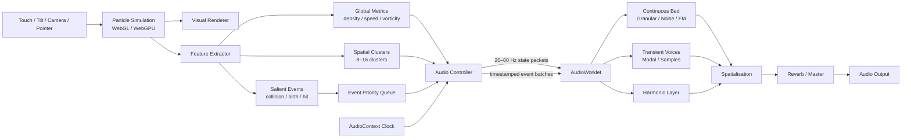
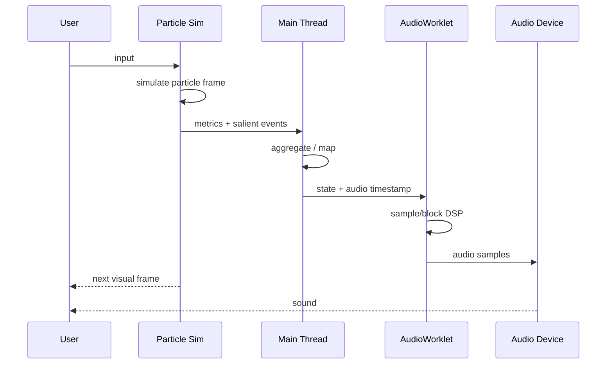
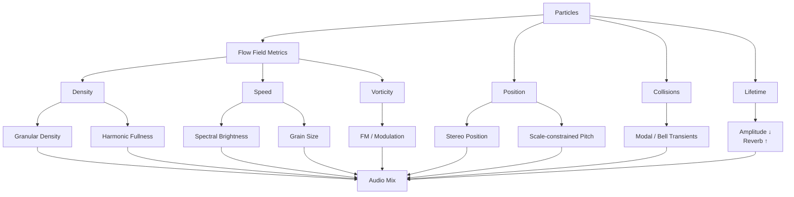

# インタラクティブ・インスタレーションのための視聴覚パーティクル・システム設計論

## エグゼクティブサマリー

SIGGRAPH/ACM TOG、NIME、ICMC、ACM Multimedia/CHI、AES、および teamLab、Ryoji Ikeda、Random International、Refik Anadol の作品・一次資料を横断して調査すると、「美しいパーティクルにどんな音を付けるか」という問題には、単一の定石があるわけではありません。むしろ、**コンピュータグラフィックス、音響合成、知覚心理学、デジタル楽器研究、インタラクションデザイン、メディアアートで別々に蓄積された知見を統合する必要があります。**

特に重要な結論は次の通りです。

第一に、**「一粒＝一音」という実装は、パーティクル・インスタレーションの基本戦略としては避けるべき**です。NIMEの流体シミュレーション作品では、150×116の流体状態をそのまま音にせず近傍を集約して約400値に落とし、その後さらに知覚的に整理された音空間に変換しています。別のNIME作品 residUUm でも、最大発音数を明示的に制限しています。これはCPU負荷だけではなく、聴覚的な可読性の問題でもあります。citeturn22view0turn22view1turn23view0

したがってWebアプリでは、たとえば視覚上は数万〜数十万粒を描いていても、音響側では次の**三階層**に圧縮するのが有効です。

> **micro:** 衝突・生成・消滅など少数の顕著なイベント  
> **meso:** 8〜16程度の粒子群・空間クラスタ  
> **macro:** 全体の密度、平均速度、渦度、流れ方向など「場」の状態

そして音響側も、

> **短いイベント音 + 連続した場の音 + 音楽的／空間的な大域層**

という三層にします。

これは今回の調査から得られる、最も実装価値の高い原則です。

第二に、視聴覚対応には心理学的に強いものと弱いものがあります。特に **高い視覚位置 ↔ 高い音高** は非常に再現性の高い cross-modal correspondence です。音高は視覚的位置だけでなく大きさなどとも自動的に対応し、高音はより速い視覚運動として知覚されやすいという実験結果もあります。citeturn24search1turn24search2turn24search0 視覚的な明るさと音響的な「明るい音色」にも対応がありますが、音色・色彩の関係は音高ほど単純ではありません。citeturn25search0turn25search3

一方、**粒子密度 ↔ 音量** や **加速度 ↔ attack time** は、非常に使いやすいデザイン・マッピングではあるものの、音高↔高さと同じ意味で普遍的な知覚法則と呼ぶべきではありません。後述するレシピでは、「知覚研究で支持が強い対応」と「芸術／sonification上有効な設計則」を区別します。

第三に、美しいパーティクル音響と特に相性がよいのは **granular synthesis** です。視覚粒子と音響grainはともに、多数の短い要素の「密度・寿命・位置・速度・散らばり」から巨視的なテクスチャを形成するため、構造的な類似性があります。NIMEの流体楽器では、空間を400セルに分解し、各セルの流速でgranular/concatenative音響を駆動しています。2026年のNIME XRAVI研究でもvisual-first楽器の音はgranular synthesisを基盤としています。citeturn23view0turn22view2turn23view1 WebではTone.jsの`GrainPlayer`が簡易実装に適し、より大量・特殊なgrainを扱うならAudioWorkletによる独自エンジンに移行するのが妥当です。citeturn30search1turn19search1

第四に、**映像と音の因果関係を観客が理解できることそのものが美的品質の一部**です。residUUmの評価では音と映像の関係は概して理解された一方、視覚的フィードバックを伴わないキーボード操作などは因果関係が分かりにくいと評価されました。citeturn23view2 「高度な音響」よりも、

> 粒がぶつかった瞬間に音が鳴る  
> 流れが速くなると音の質感も速くなる  
> 渦が強くなると音も回転する

といった**可読性の高い因果構造**の方が重要です。

第五に、低遅延Web実装では、描画フレームから直接音を生成するのではなく、**AudioContextの時計を音響時間の基準**にし、メインスレッドから低次元化された状態とイベントだけをAudioWorkletへ渡すべきです。Web Audio仕様は用途によって3–6 msから25–50 ms程度までを「reasonable latency」の範囲として挙げていますが、これは許容遅延の普遍的閾値ではありません。インタラクティブ楽器的な直接操作では可能な限り低く、安定した遅延を目指すべきです。citeturn19search1turn26search8 また、人間の audiovisual temporal binding window にはかなり大きな個人差・刺激依存性があるため、「映像と音は○ms以内なら同期して見える」という単一の閾値を設計基準にするのは不適切です。citeturn26search0turn26search1

本報告としての最終的な推奨構成は、

\[
\boxed{
\text{Particle Field}
\rightarrow
\begin{cases}
\text{Salient Events}\\
\text{Clusters}\\
\text{Global Field}
\end{cases}
\rightarrow
\begin{cases}
\text{Transient / Modal}\\
\text{Granular / Noise / FM}\\
\text{Harmony / Reverb / Spatial}
\end{cases}
}
\]

です。

これは「パーティクルに音を付ける」のではなく、**視覚と聴覚の双方を、同じ見えない力場から生じる二つの現象として設計する**考え方です。Ryoji Ikedaのdatamaticsが「pure data」を音と映像の共通源とし、Refik Anadolの作品がデータを視覚・音響双方の素材にしていることとも通じます。citeturn28search7turn29search1


## 研究地図と視聴覚知覚

このテーマについて文献を調べる際、「audiovisual particle system」だけを検索しても十分な知見は集まりません。実際には各研究コミュニティが異なる部分を研究しています。

| 分野・会議 | 主に蓄積されている知見 | Webパーティクルへの意味 |
|---|---|---|
| SIGGRAPH / ACM TOG | 流体・衝突・振動を物理現象から音にする procedural / physically based sound | パーティクル物理から「原因のある音」を生成 |
| NIME | gesture–sound mapping、AV instrument、granular、観客から見た因果関係 | インタラクションと音響マッピングの中核 |
| ICMC | granular synthesis、gesture mapping、generative systems、OSC等 | 音響アルゴリズムと制御戦略 |
| ACM Multimedia / CHI | mapping-by-demonstration、HCI、アクセシビリティ | ユーザーが理解できるmapping、個人適応 |
| AES | spatial audio、HRTF、Ambisonics、低遅延音響 | インスタレーションの空間音響 |
| 知覚心理学 | cross-modal correspondence、temporal binding | mappingの心理学的根拠 |
| Interactive Art | 完成作品としての時間・空間・身体との関係 | 「正しいmapping」より作品世界としての整合性 |

この分散自体が重要です。**「美しい音付きパーティクル」の完成形を直接教えてくれる論文は少なく、必要な知識を複数分野から組み立てる必要があります。**

### 音高と高さ

最も信頼して使える対応です。

Küssnerらの研究では、音高が高くなるほど手の表現位置が高くなるという pitch–height correspondence が再確認されています。Evans & Treismanの一連の実験でも、音高と視覚位置、大きさ、空間周波数、contrastの間に自然なcross-modal mappingが存在し、課題と無関係な場合にも処理へ影響します。citeturn24search1turn24search2

したがってスクリーン座標で、

\[
y=0 \quad\Rightarrow\quad high\ pitch
\]

\[
y=H \quad\Rightarrow\quad low\ pitch
\]

は非常に有力です。

ただし言語・文化・音楽訓練などによる変動もあるため、「自然法則」というより**強い傾向**として扱うのが適切です。Küssnerらも音楽訓練によってmappingの一貫性が変わることを報告しています。citeturn24search1

### 大きさと音高

Evans & Treismanの研究はpitch–size対応も支持しており、小さい対象と高音、大きい対象と低音というmappingは利用しやすいものです。citeturn24search2

実際、NIMEのresidUUmでは、

> smaller particle → higher oscillator frequency

という対応を採用しています。さらにshapeをwaveform、colourをfilter-bankのnotch周波数へ対応させています。citeturn22view0

したがって、小さく鋭い光粒子が高く澄んだ音、大きくゆっくりした粒子が低い音を持つという設計は、知覚研究と実作例の双方から裏付けがあります。

### 明るさと音色

視覚的brightnessと音響的brightnessの関係も重要です。

近年の研究では、知覚的に「bright」な音色、高い音色は、より明るい色と対応する傾向があります。またtimbral brightnessはpitchの知覚にも影響し、場合によってはvisual brightnessにも影響することが報告されています。citeturn25search0turn25search3

ここから、視覚brightness \(B\in[0,1]\) を単純なpitchだけに使うのではなく、

\[
B \rightarrow \text{spectral centroid}
\]

すなわち

> 暗い粒 → fundamental優勢、low-pass  
> 明るい粒 → 高次倍音増加、filter cutoff上昇

とする方が、音響的にも豊かです。

これは後述する**一つの視覚属性を一つの音響属性に対応させ過ぎない**という設計にも重要です。

### 速度と音高・時間特性

Zhangらは、聴覚pitchが視覚運動速度の知覚に影響し、高音によってより速く、低音によってより遅く知覚される方向の効果を報告しています。citeturn24search0turn24search22 またKüssnerらのgesture研究ではtempo増加とmovement speed増加の対応が確認されています。citeturn24search1

したがって、

\[
|\mathbf v|\uparrow
\Rightarrow
pitch\uparrow
\]

は十分な根拠があります。

ただし、速度を直接pitchに割り当てると、位置もpitchに割り当てている場合に競合します。

そこで実装上は、

> Y位置 → scale degree  
> 速度 → register / octave / brightness

のように分離するとよいでしょう。

一方、

\[
speed\uparrow\Rightarrow attack\ time\downarrow
\]

という対応は、pitch–speedほど確立したcross-modal correspondenceではありません。しかし、「高速運動＝鋭い過渡音」という物理的・生態学的な因果モデルを作る上では非常に有用な**設計ヒューリスティック**です。

### 密度と音量

ここは注意が必要です。

「粒子が増えるほど音が大きくなる」は直感的で、インスタレーションでも使いやすいのですが、pitch–heightと同程度に確立した普遍的cross-modal correspondenceとみなす根拠は弱いです。視覚と音響の「intensity」の間には対応が報告されていますが、複雑な動的刺激では文脈依存性が増します。citeturn25search6

したがって、

\[
density \rightarrow loudness
\]

を単純な線形mappingにするより、

\[
density
\rightarrow
\begin{cases}
grain\ rate\\
number\ of\ partials\\
spectral\ fullness\\
slightly\ increased\ loudness
\end{cases}
\]

とすることを本報告では推奨します。

つまり、

> 「粒が多いから単にうるさい」

ではなく、

> **「粒が多いから音が厚い」**

とするわけです。

### audiovisual同期

映像と音が同じ出来事として知覚される時間範囲、temporal binding windowには大きな個人差があります。また学習・刺激強度などによっても変化します。citeturn26search0turn26search1

したがって「100 ms以内なら大丈夫」のような固定ルールは適切ではありません。

さらに、**知覚的に二刺激を同一イベントと認識できること**と、**インタラクティブな操作が気持ちよく感じられること**は別問題です。

Web Audio仕様も、interactive applicationでは遅延が増えるほどresponsivenessやmusical timingを損ない、用途によって3–6 msから25–50 ms程度までがreasonableな範囲になり得る、としています。citeturn19search1

したがって設計目標としては、

> **直接的な身体入力 → 音：できれば20 ms前後以下を目指す**  
> **粒子イベント → 音：映像フレームではなくAudioContext clockでschedule**  
> **長いpad・reverb・granular cloud：多少の遅延を許容**

という**役割別の遅延設計**が適切です。

この考え方は重要で、すべての音を同じ厳密さで同期させる必要はありません。


## 音響合成と空間化の設計

パーティクルの音響表現に使える主要技法をWeb実装の観点から比較すると、次のようになります。

| 音響方式 | 向く視覚現象 | 長所 | 弱点 | Web適性 |
|---|---|---|---|---|
| Granular | 星屑、砂、煙、水流、雲 | 粒子的構造が視覚と対応、密度操作が自然 | grain数が多いとCPU負荷 | ★★★★★ |
| Filtered noise | 風、煙、乱流、流体 | 非常に軽い、連続場に強い | 個々の粒の存在感が弱い | ★★★★★ |
| FM | 渦、エネルギー、電気、発光 | 少数voiceで豊かな音色 | modulation過多で攻撃的 | ★★★★★ |
| Additive | 光粒子、スペクトル、星 | brightnessとの対応が明瞭 | oscillator数増加が重い | ★★★★☆ |
| Modal / physical modelling | 衝突、滴、物質粒子 | 因果関係・物質感が強い | DSPが複雑 | ★★★★☆ |
| Sample / concatenative | 有機物、自然音、アーカイブ | 音色品質が高い | 素材準備、メモリ | ★★★★☆ |
| Spectral processing | データ、Ikeda型抽象表現 | 非常に独特、データ感 | FFT latency、独自DSP | ★★★☆☆ |
| Convolution / reverb | 空間、余韻、消滅 | 没入感が大きい | tail・CPU・latency | ★★★★☆ |
| Stereo/HRTF panning | 移動・群れ | 位置対応が直接的 | 多数sourceで負荷 | ★★★★★ / ★★★★☆ |
| Ambisonics | 大規模空間、360° | 場そのものを空間化可能 | routing/decoderが複雑 | ★★★☆☆ |

### granular synthesis

今回の目的には最優先候補です。

granular synthesisでは短い音断片を多数重ね、

- grain rate
- grain size
- overlap
- playback position
- pitch
- jitter
- stereo position

を制御します。

これはparticle systemの、

- density
- size
- lifetime
- velocity
- position
- turbulence

とほぼ同型です。

NIME 2013のFluid Simulationでは、初期には各流体領域を固定band-pass周波数に割り当てましたが、特定位置が常に同じ周波数になるため表現が単調になったと報告しています。その後、音素材をtimbre similarityで並べたgranular/concatenative方式へ移行し、隣接した流体領域から知覚的にも近い音色が出る構造にしています。citeturn22view1turn23view0

これは非常に重要な知見です。

**空間を単純に周波数軸へ変換するより、知覚的に滑らかな「音色場」を作る方が、流体や粒子には向いている。**

WebではTone.jsの`GrainPlayer`がgranular synthesisを直接提供し、grain sizeやoverlapを制御できます。citeturn30search1

### filtered noise

continuous layerには最も費用対効果が高い方式です。

たとえば、

\[
vorticity \rightarrow Q
\]

\[
speed \rightarrow cutoff
\]

\[
density \rightarrow gain
\]

とすれば、

> 静止 → 暗く静かな気配  
> 流れる → 高域が開く  
> 渦巻く → resonant / modulated noise

となります。

数万粒子を音にしているように感じさせながら、実際には数個のnoise generatorだけで済みます。

これはWeb Audioの`AudioBufferSourceNode`、`BiquadFilterNode`、`GainNode`程度でも実装できます。Web Audio APIはこのようなmodular audio graphとsample-accurate parameter automationを標準提供しています。citeturn19search1turn30search0

### FM synthesis

FMは、「流れがエネルギーを持つ」表現に特に向きます。

\[
y(t)=\sin(2\pi f_ct+I\sin(2\pi f_mt))
\]

で modulation index \(I\) を、

\[
I = I_{min}+(I_{max}-I_{min})\,\omega_n
\]

とし、正規化渦度 \(\omega_n\) と結びつけると、

> 静かな流れ → 純音  
> 渦が強い → 複雑な倍音

になります。

これは一つのvoiceでもかなり複雑な音になるため、Webに向いています。Tone.jsもFM系instrumentを提供しています。citeturn30search7turn30search16

ただしFMは少し値を変えるだけでスペクトルが大きく変化します。したがってraw sensor値を直接modulation indexへ入れず、

\[
I = 0.1 + 7.9\omega_n^\gamma
\]

のように非線形圧縮する方が安定します。

### additive synthesis

光の粒との相性が非常によい方式です。

粒子のクラスタをpartial群として、

\[
s(t)=\sum_{k=1}^{N} a_k\sin(2\pi f_k t+\phi_k)
\]

とすれば、

> 粒子密度 → partial数  
> brightness → 高次partialのgain  
> turbulence → partial detuning

という対応が可能です。

ただし、10万particleに10万oscillatorを割り当てるという意味ではありません。

たとえば1クラスタにつき8〜16 partial、8クラスタなら64〜128 partialです。これなら独自AudioWorkletで効率的に生成できます。

### physically based / modal sound

SIGGRAPH系研究は非常に興味深い方向を示しています。

液体音については、物理シミュレーションからbubbleなどの音源現象を推定し、そこから音を生成する研究が行われてきました。SIGGRAPH 2009のHarmonic Fluidsは流体シミュレーションに物理ベースの音響生成を結びつけ、その後もcoupled bubblesを用いた改良が続いています。citeturn28search1turn28search16turn28search5 それ以前にもphysically based liquid sound modelsが提案されています。citeturn28search0

Webパーティクルへ応用する場合、完全な流体音響計算をする必要はありません。

重要なのは、

> **音をparticle属性へ任意にmappingするのではなく、音を発生させる「原因」を推定する**

という思想です。

例えば衝突なら、

\[
E_{collision}\propto m|\Delta v|^2
\]

をexcitation energyとして、modal resonatorへimpulseを送ります。

そうすると、

```text
粒子が衝突
   ↓
衝突エネルギー
   ↓
物質モデル
   ↓
ring / click / bell
```

となり、「映像に音を付けた」というより「そこに物体が存在している」印象になります。

### event layerとcontinuous layer

これを分けることを強く推奨します。

**Event layer**

- collision
- birth
- disappearance
- boundary hit
- sudden acceleration

など。

音は、

- click
- bell
- modal resonance
- short FM burst
- sample grain

などです。

**Continuous layer**

- global density
- mean velocity
- flow direction
- turbulence
- vorticity

など。

音は、

- granular cloud
- filtered noise
- pad
- additive drone
- slowly modulated FM

です。

この組み合わせにすると、

> micro-eventによる因果性  
> +  
> macro-fieldによる雰囲気

を同時に得られます。

### spatial audio

まず2D画面なら、

\[
pan=2x/W-1
\]

で十分です。

residUUmもX位置をstereo panへ直接mappingしています。Y位置はamplitudeとgranular oscillator用band-pass filter中心周波数へ使われています。citeturn22view0

3Dの場合、Web Audioの`PannerNode`は3次元位置とequal-power/HRTF panningを扱えます。HRTFはより空間的な定位を提供する一方、計算量は増えます。citeturn19search1

したがって、

> 10,000 particles → 10,000 PannerNodes

ではなく、

> 10,000 particles → 8 spatial clusters → 8 PannerNodes

とします。

Ambisonicsが必要ならOmnitoneはWeb Audioの`GainNode`と`ConvolverNode`を利用したAmbisonic decoding / binaural renderingを提供し、first-orderからhigher-orderまで扱います。citeturn30search2 AESでもAmbisonics、binaural、HRTF、location-based installationは継続的な研究領域です。citeturn27search0turn27search1

ただし最初のプロトタイプなら、まずstereo、次にHRTF、最後にAmbisonicsと段階を踏む方がよいでしょう。


## マッピング・レシピ

ここでは、研究知見をWeb実装向けの具体式へ変換します。

以下の数値範囲は「知覚閾値」ではなく、**本報告がプロトタイプの探索開始点として推奨する範囲**です。

まず任意の量 \(x\) を、

\[
N(x;a,b)=
\operatorname{clamp}
\left(
\frac{x-a}{b-a},0,1
\right)
\]

で正規化します。

実際には最大値ではなく、最近数秒間の95 percentileなどを \(b\) にすると外れ値に強くなります。

周波数はlinear interpolationではなくlogarithmic mappingにします。

\[
f(u)=f_{min}
\left(
\frac{f_{max}}{f_{min}}
\right)^u
\]

人間のpitch perceptionと音楽的octave構造に適しています。

### 推奨マッピング表

| Particle metric | Audio parameter | 推奨式・範囲 | 根拠の強さ |
|---|---|---|---|
| Y position | pitch | 110–1760 Hz、scale quantise | 強いcross-modal |
| X position | pan | −0.9〜+0.9 | 空間的同型 |
| size | pitch | size↑ → pitch↓ | 強いcross-modal＋NIME実例 |
| brightness | cutoff / spectral centroid | 300–8000 Hz | 比較的強い |
| speed | register / cutoff / grain rate | 0→1で低→高/遅→速 | pitch-speedに実験支持 |
| acceleration | attack time | 80→2 ms | 設計ヒューリスティック |
| density | grain rate / spectral fullness | 5–60 grains/s | sonification設計 |
| density | amplitude | −36→−12 dB程度、圧縮 | 補助的mapping |
| vorticity | FM index / modulation | 0.1–8 | 芸術的mapping |
| lifetime | amp / reverb | old→quiet / wet | NIME実例＋設計 |
| collision impulse | transient amp | −30〜−6 dB | 物理ベース |
| flow direction | stereo/spatial direction | angle→azimuth | 空間的同型 |

「根拠の強さ」は本報告の文献統合上の分類であり、標準化された心理尺度ではありません。pitch–heightやpitch–sizeには実験的支持が強い一方、density–loudnessやvorticity–FMは作品設計上のmappingとして考えるべきです。citeturn24search1turn24search2turn25search6

### 位置からpitch

画面上端を高音とします。

\[
u_y=1-\frac yH
\]

自由pitchなら、

\[
f=110\times 2^{4u_y}
\]

で110〜1760 Hzです。

ただしインスタレーションでは完全連続pitchよりscale quantisationの方が扱いやすい場合があります。

例えばmajor pentatonic:

```text
[0, 2, 4, 7, 9]
```

を使い、

\[
i=\lfloor u_y(N-1)+0.5\rfloor
\]

でscale degreeを選びます。

この方法なら大量のイベントが鳴っても半音衝突が比較的起こりにくくなります。

### 速度からbrightness

速度をpitchにも使うと位置との競合が生じるので、こちらを推奨します。

\[
s=N(|\mathbf v|;0,v_{95})
\]

\[
f_c=300\times2^{4s}
\]

おおよそ、

\[
300\ \mathrm{Hz}
\rightarrow
4800\ \mathrm{Hz}
\]

です。

視覚的にザザーッと加速すると、音が「高くなる」というより**開いて明るくなる**ため、派手ですが音楽的pitch構造を破壊しません。

### 速度からgrain rate

\[
r_g=5+55s^{1.5}
\]

として、

```text
静止       5 grains/s
中程度    20–30 grains/s
高速      60 grains/s
```

程度にします。

さらにgrain sizeを逆方向へ、

\[
T_g=0.15-0.12s
\]

として、

```text
低速 150 ms
高速  30 ms
```

とすると、

> ゆっくり → 大きく柔らかな音粒  
> 高速 → 細かくキラキラした音粒

になります。

### 密度

linear amplitudeは避けます。

\[
\rho=N(n;0,n_{95})
\]

として、

\[
G_{dB}=-36+24\sqrt{\rho}
\]

程度に圧縮します。

より重要なのは、

\[
grainRate=5+45\rho
\]

\[
partials=2+\lfloor14\rho\rfloor
\]

とすることです。

つまりdensityはまず**音の厚さ**へ割り当て、音量は補助的に変える。

この方が高密度時の「爆音化」を避けられます。

### 加速度

\[
a=N(|\mathbf a|;0,a_{95})
\]

\[
attack=0.002+0.078e^{-4a}
\]

とすれば、

> ゆっくりした運動 → 約80 msの柔らかいattack  
> 急加速 → 数msの鋭いattack

になります。

同時にspectral brightnessを上げてもよいでしょう。

### vorticity

2D velocity field \(\mathbf v=(v_x,v_y)\) なら、

\[
\omega=
\frac{\partial v_y}{\partial x}
-
\frac{\partial v_x}{\partial y}
\]

を計算します。

正規化した \(\omega_n\) から、

\[
FMIndex=0.1+7.9\omega_n^{1.5}
\]

とすると、強い渦で倍音が増えます。

さらに、

\[
LFORate=0.1+5\omega_n
\]

としてtremoloやfilter modulationを掛ければ、

> **見える渦と聞こえる渦**

を作れます。

### lifespan

residUUmはparticle lifespanが減少するにつれて、amplitudeを下げ、envelopeにnoiseを増やしています。つまり老化したparticleほど弱く不安定になります。citeturn22view0

これを発展させ、

\[
q=\frac{age}{lifetime}
\]

\[
A=(1-q)^{1.5}
\]

\[
reverbSend=0.05+0.55q^2
\]

とすると、

> 生まれた粒 → 明瞭・dry  
> 消える粒 → 小さくなり、空間の余韻へ溶ける

という美しい時間構造になります。

これはかなり有効です。

### collision

衝突イベントには相対速度を使います。

\[
J\approx m_r |\mathbf v_1-\mathbf v_2|
\]

を正規化して、

\[
A=J_n^{0.6}
\]

とします。

pitchは粒子サイズ、

\[
f=f_0
\left(\frac{r_0}{r}\right)^\kappa,
\qquad
0.5\leq\kappa\leq1
\]

とすれば、

> 小粒 → 高い「チン」  
> 大粒 → 低い「コン」

となります。

ここにmodal resonatorを使えば物質感が強くなります。SIGGRAPHで研究されているphysically based soundの思想を軽量に応用したものです。citeturn28search0turn28search1

### 平滑化

visual frame値をそのままAudioParamへ設定するとzipper noiseや不自然な変化が起きます。

指数平滑化、

\[
y_t=(1-\alpha)y_{t-1}+\alpha x_t
\]

\[
\alpha=1-e^{-\Delta t/\tau}
\]

を使います。

目安として、

```text
pitch / pan         τ = 20–50 ms
filter              τ = 50–150 ms
density             τ = 100–300 ms
reverb              τ = 300–1000 ms
```

程度から探索できます。

Web Audioの`AudioParam`は直接`.value`を書き換えた場合に自動平滑化されるわけではなく、仕様も`setTargetAtTime()`などを利用したsmooth transitionを推奨しています。citeturn19search1


## Web実装アーキテクチャ

ここでは「美しい音」以上に重要な技術設計があります。

**particle simulatorとaudio synthesizerを直接一対一接続しないこと**です。

推奨アーキテクチャは次の通りです。



Web Audioはaudio graphを提供し、`AudioWorklet`はカスタムJavaScriptまたはWebAssembly DSPをaudio rendering threadで動作させる仕組みです。これはメインスレッドでDSPする旧`ScriptProcessorNode`より適切な方法です。citeturn19search1turn30search0

### なぜaggregationが必要なのか

NIMEのFluid Simulation研究は、この問題を非常に明確に示しています。

150×116のsimulation gridは毎フレーム扱うには情報量が多いため、近隣値を平均し、約400値へ低減しています。citeturn22view1 さらに各セルのvelocityをgranular sound unitのvolumeへ割り当てています。citeturn23view0

Webアプリではさらに積極的に、

```text
50,000 visual particles
        ↓
96 spatial bins
        ↓
8–16 active sound clusters
        ↓
24 event voices maximum
```

くらいで十分です。

視覚に5万粒あるからといって、聴覚にも5万の独立した主体が必要なわけではありません。

むしろ耳には「群れ」として聞かせる。

### クラスタリング

最も軽い方法はscreen-space gridです。

例えば12×8=96セルに分割し、セルごとに、

\[
n,\quad
\bar{x},\bar{y},\quad
\overline{v_x},\overline{v_y},\quad
\bar{|v|},\quad
\omega
\]

だけを計算します。

その中から、

\[
salience =
w_1 density +
w_2 speed +
w_3 acceleration
\]

が大きい上位8〜16セルだけを音響化します。

複雑なK-means clusteringを毎frame実行する必要はありません。

### event explosionの防止

衝突が1frameに2000回起きても2000音鳴らしてはいけません。

イベントをenergyでsortし、

```text
top K events per 16 ms
```

だけを採用します。

さらに同じ領域・近い時刻のイベントを、

\[
E_{merged}=\sum_i E_i
\]

としてまとめます。

これにより、

> 無数の砂粒衝突 → 一つの「ザッ」  
> 数個の強い衝突 → 個別の「チン」

という自然な階層になります。

### audio scheduling

映像は`requestAnimationFrame`、音は`AudioContext.currentTime`を基準にします。



重要なのは、

```javascript
performance.now()
```

だけで音を制御するのではなく、

```javascript
audioContext.currentTime
```

の座標系へイベントを移すことです。

Web Audio APIは`AudioParam`の変更やsource startを`AudioContext.currentTime`基準で精密にscheduleできます。citeturn19search1

### AudioWorkletの基本形

メインスレッド側は概念的に次のようになります。

```javascript
const audioContext = new AudioContext({
  latencyHint: "interactive"
});

await audioContext.audioWorklet.addModule(
  "/particle-audio.worklet.js"
);

const synth = new AudioWorkletNode(
  audioContext,
  "particle-audio",
  {
    numberOfInputs: 0,
    numberOfOutputs: 1,
    outputChannelCount: [2]
  }
);

synth.connect(audioContext.destination);

function sendParticleAudioState(state, events) {
  synth.port.postMessage({
    type: "frame",
    // A small look-ahead; tune according to measured latency.
    audioTime: audioContext.currentTime + 0.010,
    state,
    events
  });
}
```

`latencyHint: "interactive"`は低遅延を希望する指定であり、ブラウザがその値を保証するものではありません。実測には`AudioContext`のlatency関連情報を利用します。Web Audio仕様自体も実装・デバイスによって実際のlatencyが異なることを前提としています。citeturn19search1turn30search0

AudioWorklet側では、重要なのは**`process()`内で毎回オブジェクトや配列を生成しないこと**です。

```javascript
class ParticleAudioProcessor extends AudioWorkletProcessor {
  constructor() {
    super();

    this.targetDensity = 0;
    this.targetSpeed = 0;
    this.targetVorticity = 0;

    // Preallocated voice pool would live here.
    this.port.onmessage = ({ data }) => {
      if (data.type !== "frame") return;

      const s = data.state;
      this.targetDensity = s.density;
      this.targetSpeed = s.speed;
      this.targetVorticity = s.vorticity;

      // Push only bounded salient events into
      // a preallocated event queue / voice pool.
      this.ingestEvents(data.events);
    };
  }

  ingestEvents(events) {
    // Fixed-capacity queue / voice stealing.
  }

  process(inputs, outputs) {
    const output = outputs[0];
    const left = output[0];
    const right = output[1] ?? output[0];

    // Do not assume a particular block size:
    // use the actual array length.
    for (let i = 0; i < left.length; i++) {
      const [l, r] = this.renderSample();

      left[i] = l;
      right[i] = r;
    }

    return true;
  }

  renderSample() {
    // granular/noise/FM/modal engine
    return [0, 0];
  }
}

registerProcessor(
  "particle-audio",
  ParticleAudioProcessor
);
```

AudioWorkletはrendering thread上でaudio graphと同期して実行され、`MessagePort`によってcontrol sideと通信します。citeturn19search1

### Web技術の優先順位

本報告では以下を推奨します。

| 段階 | 技術 | 用途 |
|---|---|---|
| 最初 | Web Audio API native nodes | Gain/filter/pan/noise/sample |
| 最初 | Tone.js | scale、FM、PolySynth、granular、scheduling |
| 次 | AudioWorklet | 高密度granular、voice pool、独自DSP |
| 次 | WebAssembly DSP | spectral/modal/高度なgranular |
| 空間化 | PannerNode | 少数clusterのHRTF/3D定位 |
| 高度な空間 | Ambisonics/Omnitone等 | 360°・installation用 |

Tone.jsには`GrainPlayer`、FM系synth、Sampler、PolySynthなどが用意され、PolySynthはvoice allocationも扱います。citeturn30search1turn30search4turn30search25

したがって、研究プロトタイプではTone.jsで迅速に音響空間を探索し、「これ」という方式が固まった部分だけAudioWorkletへ落とすのが効率的です。

### fallback

ブラウザや端末性能に応じて、

```text
Ambisonics
    ↓
HRTF Panner
    ↓
StereoPanner
```

```text
custom granular
    ↓
Tone.GrainPlayer
    ↓
filtered noise + sparse samples
```

```text
48 event voices
    ↓
24
    ↓
12
```

と段階的に劣化させます。

「音が途切れる」より、「音色の複雑さを減らす」方がはるかによいです。Web Audio仕様もaudio glitchを重大なfailureとして扱い、DSP負荷過多などを避ける必要性を明記しています。citeturn19search1

また`BiquadFilterNode`、`ConvolverNode`、`DynamicsCompressorNode`など一部処理は信号経路に追加delayを持ち得ます。特に直接操作音には長いprocessing chainを通さず、reverbなどはsend経路として分離するのがよいでしょう。citeturn19search1


## 音楽的インタラクションとアクセシビリティ

ここまでのmappingをそのまま実装すると「面白い音」は作れても、必ずしも「美しい音」にはなりません。

最大の問題は**harmonic chaos**です。

100個のparticleがそれぞれcontinuous pitchを出せば、容易に不協和なクラスターになります。

そこで、音響を次の二種類に分けます。

```text
Sonification
「何が起きているか」を聞かせる

Musification
「音楽として心地よく」聞かせる
```

両者を混ぜることがポイントです。

### pitch quantisation

最も簡単なのはscaleへの量子化です。

```javascript
const scales = {
  pentatonic: [0, 2, 4, 7, 9],
  major:      [0, 2, 4, 5, 7, 9, 11],
  minor:      [0, 2, 3, 5, 7, 8, 10],
  chord:      [0, 4, 7, 11]
};
```

画面Y位置がcontinuousでも、音高はscale noteへsnapさせます。

```javascript
function yToMidi(y, height, root = 48) {
  const scale = [0, 2, 4, 7, 9];
  const u = 1 - Math.min(1, Math.max(0, y / height));

  const totalSteps = 15;
  const step = Math.round(u * totalSteps);

  const octave = Math.floor(step / scale.length);
  const degree = scale[step % scale.length];

  return root + octave * 12 + degree;
}

function midiToHz(midi) {
  return 440 * 2 ** ((midi - 69) / 12);
}
```

これによってcross-modalな高さ対応を保ちながら、音楽的秩序を加えられます。

### adaptive harmony

さらに面白いのは、global particle stateから和声を変える方法です。

例えば、

```text
low density
    → root + fifth

medium density
    → major/minor triad

high density
    → 7th / 9th chord
```

とします。

ここで重要なのは、

> **各particleが独自に和音を決めるのではなく、場全体が一つのharmonic contextを持つ**

ことです。

つまり、

```text
Global field
      ↓
Current chord
      ↓
All particle events choose notes from chord
```

です。

これにより数十のcollisionがあっても同じ世界の中の音として聞こえます。

### harmonyにhysteresisを入れる

密度がthreshold付近を行き来するたびにコードが変わると落ち着きません。

そこで、

```text
density > .70 for 500 ms → state C
density < .55 for 500 ms → state B
```

のようなhysteresisを使います。

視覚のflow fieldが滑らかなら、音楽構造も滑らかに変化させるべきです。

### rhythmicisation

collisionをそのまま鳴らすと、音楽的にはランダムになります。

そこでeventをtempo gridへquantiseする方法があります。

BPMを \(b\)、16分音符なら、

\[
T_{16}=\frac{60}{4b}
\]

です。

120 BPMなら125 msです。

しかし、**すべてを125 ms遅らせるとinteractive feedbackとしては遅い**。

そこで二層化します。

```text
collision
   ├── immediate layer
   │       tiny click / noise / haptic-like transient
   │       0 ms quantisation
   │
   └── musical layer
           bell / note / grain
           quantised to 1/8 or 1/16
```

これが非常に有効です。

即時音が「自分が起こした」と伝え、quantised layerが「音楽として美しく」整えます。

### probabilityとsalience

すべてのcollisionを音にする必要はありません。

\[
P(trigger)=
p_{min}+
(p_{max}-p_{min})E^\gamma
\]

とし、高energyイベントほど鳴りやすくします。

これにより、

> 視覚上は無数の粒  
> 聴覚上は重要な出来事だけ

となります。

この「selective sonification」は聴覚的混雑を防ぐ上で非常に重要です。

### 音響と映像の役割を重ね過ぎない

pitch、loudness、filter cutoff、grain rateすべてをspeedから制御すると、動きは派手でも情報次元は一つしかありません。

良いmappingは概ね、

```text
POSITION    → pitch / pan
ENERGY      → attack / brightness
DENSITY     → grain density / spectral fullness
ROTATION    → modulation
AGE         → envelope / reverb
EVENT       → transient
```

のように**役割を分離**します。

residUUmもsize、shape、colour、group、X、Y、lifespanを異なる音響属性へ割り当てています。citeturn22view0

### transparencyとagency

residUUmの観客評価から興味深いことが分かります。

音と映像の関係は比較的明瞭と評価された一方、観客が見えないkeyboard操作によって変化するものは因果関係が理解されにくいという結果でした。citeturn23view2

したがってインスタレーションでは、

> 操作 → 視覚変化 → 音響変化

の三者が同じ方向を向くことが重要です。

例えばiPadを右に傾けた場合、

```text
傾き
 ↓
flow fieldが右へ
 ↓
particleが右へ流れる
 ↓
sound centroid / stereo energyも右へ
```

とすれば、非常に読み取りやすい。

逆に、

```text
右へ傾ける
 ↓
粒は右へ
 ↓
音は突然低くなる
```

というmappingは、作品として意図的でない限り因果性が弱くなります。

NIME 2026のXRAVI研究も、audio-firstとvisual-firstでは最終的な設計過程がかなり異なり、inter-modality mappingを制作過程で繰り返し再検討する必要性を示しています。citeturn21search2turn23view1

### アクセシビリティ

ここでは「cross-modal correspondenceがあるから、すべての人に分かる」と考えないことが重要です。

cross-modal対応には個人差、経験差があります。citeturn24search1turn26search0 CHI 2024のdeaf / hard-of-hearing audio engineersへの研究は、音響制作におけるアクセシビリティが単純な「聞こえる／聞こえない」問題ではなく、視覚的手掛かりやワークフローの工夫と密接であることを示しています。citeturn30search3turn30search9

したがって本システムでは、少なくとも、

- 音だけに重要情報を載せない
- 色だけにも重要情報を載せない
- master volume / dynamic rangeを調整可能にする
- 高音だけを唯一のfeedbackにしない
- visual intensityとaudio intensityを個別に調整できる
- reduced motion / reduced audio complexityを持たせる

という冗長性を持たせるべきです。

特に研究用途なら、

```text
Visual mapping strength
Audio mapping strength
Cross-modal coupling strength
```

を別々のsliderにしておくと、ユーザー群ごとの差も研究できます。


## ケーススタディ

ここでは「何の音を使ったか」だけでなく、**音と映像をどの階層で結び付けたか**に注目します。

| 作品 | AV結合の単位 | Sonic palette / 方法 | 本プロジェクトへの教訓 |
|---|---|---|---|
| residUUm | 個々のparticle属性 | oscillator, waveform, filter, granular, pan | 明示的mappingとvoice limit |
| Fluid Simulation | 空間セル／流体場 | granular/concatenative | 大量状態を集約して音色場へ |
| teamLab Water Particles | 生態系／作品世界 | 詳細非公開、作曲あり | 音を粒子単位に限定しない |
| Ryoji Ikeda datamatics | 共通データ | minimal electronic/data sound | 「同じデータ」を共通scoreに |
| Rain Room | 物理現象そのもの | 実際の雨音 | sonificationしない選択 |
| Refik Anadol | 共通データ／archive | cinematic/multichannel | visualとaudioを並列データ彫刻化 |

### residUUm

今回のテーマに最も直接的な学術事例です。

NIME 2016で発表されたresidUUmはparticle systemそのものをaudio-visual performance toolにしています。citeturn21search0turn21search3

具体的mappingは、

| Visual | Audio |
|---|---|
| size | main oscillator frequency |
| shape | oscillator waveform |
| colour | filterbank notch frequencies / timbre |
| group | LFO waveform、collision sonic signature |
| X | stereo pan + AM-LFO frequency |
| Y | amplitude + granular band-pass centre |
| lifespan | amplitude低下 + envelope noise増加 |
| background | master effects |

です。citeturn22view0

さらにProcessing側particle engineとPure Dataのpolyphonic synthesizerをOSCで接続し、最大voice数を制限しています。citeturn22view0

重要なのは、単にたくさんmappingしたことではなく、

> **一つのparticleに sonic identity を持たせている**

ことです。

shapeやgroupが変わると音色的identityも変わります。

Web版に持ち込むなら、全particleではなく**代表particle / clusterにidentityを持たせる**のが現実的でしょう。

### Fluid Simulation as Full Body Audio-Visual Instrument

NIME 2013のAndrew Johnstonによる研究は、「場」をどう音にするかという意味でさらに重要です。citeturn21search1

初期方式ではfluid gridのvelocityを固定band-pass filter bankのgainへmappingしました。しかし特定領域がいつも同じ周波数を生むため単調になり、より複雑なsound spaceへ移行しています。citeturn22view1

最終的にはaudio sampleを音色類似度で並べ、400 fluid cellsそれぞれがgranular sound unitのvolumeを駆動します。隣接領域は知覚的に似たsoundを持つよう設計されています。citeturn23view0

これは今回のWebアプリへほぼ直接応用できます。

```text
Flow field
    ↓
spatial cells
    ↓
velocity / density
    ↓
timbral manifold
    ↓
granular cloud
```

つまり画面上に**見えない音色地図**を置くわけです。

たとえば左上はglass系grain、中央はwater系、右下はbreathy noiseという固定配置ではなく、timbre similarity空間に滑らかに配置すれば、粒子が移動すると音色も連続的に変化します。

### teamLab — Universe of Water Particles

teamLabは水を「多数の粒子の連続体」として計算し、particleの相互作用からlineを描くと説明しています。人が滝の中に立つと岩のように流れを遮り、流れそのものが変化します。citeturn28search18turn28search28 作品にはHideaki Takahashiがsound担当として明記されています。citeturn28search2turn28search10

ただし、公開されたartist statementからは、

> 「particle velocityを○Hzにmappingしている」

といった詳細な音響アルゴリズムまでは確認できません。

したがってそこを推測して事実として扱うべきではありません。

むしろ学ぶべきなのは構造です。

```text
visitor
   ↓
world physics
   ↓
water field
   ↓
visual continuum

          + sonic environment
```

つまり音をparticle debugging visualizationの聴覚版にせず、**作品世界全体の状態を支える層**として扱うことです。

これは今回のシステムなら、

> particle event音 30%  
> field / atmospheric音 70%

くらいの設計を試す価値があることを示唆します。

### Ryoji Ikeda — datamatics / test pattern

Ryoji Ikedaは別の極端な解を示しています。

datamaticsは「pure data」をsoundとvisualの双方のsourceとして使うと公式に説明されています。citeturn28search7

これは、

```text
visual → sound
```

でも、

```text
sound → visual
```

でもありません。

```text
       DATA
      /    \
 visual    sound
```

です。

この**common source architecture**は非常に強力です。

test patternでは、text、sound、photo、movieなどのdataをbinary/barcode patternへ変換し、人間の知覚限界とデバイス性能の境界を探っています。citeturn28search3 初期版では16-channel sound signalが空間的gridとして配置され、そのsignal patternとvisual barcodeがリアルタイムに緊密に同期しています。citeturn28search11

パーティクルへ応用すれば、

```text
flow field
  ├─ particle motion
  ├─ FM modulation
  ├─ rhythm density
  └─ spatial sound field
```

のように、**同じ潜在変数から映像と音を生成する**方法になります。

これは美的統一感を作る非常に有力な方法です。

### Random International — Rain Room

Rain Roomは、パーティクル音響設計を考える上で意外に重要な反例です。

訪問者は雨の中を歩きますが、人の周囲だけ雨が止まり濡れません。一方で雨のsoundとsmellは強く存在します。citeturn29search0

ここでは、

> 雨粒データ → シンセ音

というsonificationをしません。

**雨は雨自身の音を持っている。**

これは重要です。

CG particleでも、表現対象が水、砂、木片など物質的に明確なら、

> artificial synthを追加する  
> より  
> plausible physical soundを作る

方が世界への没入を高める可能性があります。

したがってパーティクル作品では、

```text
abstract light
    → granular / FM / additive

water / sand / stone
    → procedural / modal / physical sound
```

という分岐を考えるべきです。

### Refik Anadol — WDCH Dreams / Machine Hallucinations

Refik Anadolの作品も「particle一粒＝音」という考えから離れています。

WDCH DreamsではLA Philharmonicの大規模archiveが視覚素材となり、soundtrackもLA Phil archival recordingsから構成されています。さらにsound designersはmachine-learning algorithmsを用いて類似performanceを探索しています。8-channel soundで大型projectionと組み合わされています。citeturn29search1

Machine Hallucinations: Coral Dreamsではquadraphonic audioが用いられ、sound designはKerim Karaogluと記載されています。citeturn29search2

ここでも正確なvisual parameter→audio parameter mappingは公開資料から確認できないため、推測すべきではありません。

しかし設計原則は明瞭です。

> **映像と音が同じデータ世界から生まれる。**

これはIkedaとも共通します。

今回の作品でも、

```text
Particle data
    ↓
Latent world state
    ├── visual renderer
    └── audio composer
```

とし、音をparticle rendererのslaveにしない方が、長時間鑑賞に耐える可能性があります。


## 実験計画と最小プロトタイプ

以上を実装へ落とすなら、最初から「完成作品」を作るより、**Audiovisual Particle Laboratory**として構築し、知覚・美的パラメータを探索できる形にするのが最も合理的です。

### 最小構成

まず視覚側を、

```text
10k–50k particles
WebGL / WebGPU

attributes:
  position
  velocity
  acceleration
  age
  lifetime
  brightness
  size
```

とします。

そこからaudio feature extractorが、

```text
global:
  density
  meanSpeed
  speedVariance
  meanDirection
  vorticity
  collisionRate

clusters × 8–16:
  centroid
  density
  speed
  direction
  brightness

events:
  strongest collisions
  births
  deaths
  boundary impacts
```

だけを取り出します。

音響エンジンは、

```text
Continuous Field
    2–4 voices
    granular + filtered noise + FM

Cluster Voices
    max 8–16

Event Voices
    max 24 initially

Global Harmonic Voice
    1–4 voices
```

程度から始めます。

**視覚particle数とaudio voice数を完全に切り離す**のがポイントです。

### slider構成

研究用UIなら次のパラメータ群が有用です。

| 群 | Slider |
|---|---|
| Visual | particle count, size, trail, glow |
| Physics | gravity, flow, turbulence, drag, vorticity |
| Audio texture | grain size, grain rate, noise, FM index |
| Mapping | Y→pitch, speed→brightness, density→grain rate |
| Temporal | smoothing, event rate, quantisation |
| Harmony | root, scale, chord complexity |
| Space | stereo width, HRTF, cluster spread |
| Reverb | send, decay |
| Limits | max event voices, max cluster voices |
| Accessibility | visual intensity, audio intensity, reduced motion |

さらに重要なのが、

```text
Mapping Strength
```

です。

例えば、

\[
pitch=
(1-\lambda)pitch_{neutral}
+
\lambda pitch_{mapped}
\]

とし、

\[
0\leq\lambda\leq1
\]

でcross-modal couplingの強さ自体を操作可能にします。

これによって「mappingが強いほど美しいのか」を実験できます。

### 最初に比較すべき実験

最も価値が高いのは、次の比較です。

| 実験 | 条件A | 条件B | 問いたいこと |
|---|---|---|---|
| Mapping congruency | high position→high pitch | high→low pitch | CMCは美的評価に影響するか |
| Audio architecture | per-event中心 | field+event | どちらが疲れにくいか |
| Synthesis | granular | FM / noise | particleとの自然さ |
| Temporal | immediate | quantised | agencyとmusicalityのtrade-off |
| Density mapping | loudness | spectral fullness | 高密度時の快適さ |
| Spatial | stereo | HRTF | 没入感と負荷 |
| Coupling | direct mapping | common latent field | 世界の一体感 |

評価尺度は、

```text
Beauty / aesthetic appeal
Causal clarity
Sense of agency
Coherence of sound and image
Immersion
Predictability
Surprise
Listening fatigue
Desire to continue interacting
```

あたりが有用です。

residUUmの評価が示唆するように、「音と映像の関係が分かるか」と「美しいか」は分けて測るべきです。citeturn23view2

### 特に有望な第一プロトタイプ

調査結果から、最初に試す価値が最も高い音響設計を一つに絞ると、次です。



音の具体的なpaletteは、

**Background / Field**

filtered pink-ish noise  
+ soft granular cloud  
+ low-level additive/FM drone

**Particle clusters**

granular textures  
+ scale-constrained tones

**Collisions**

short modal bell / glass-like transient

**Fast movement**

spectral brightness↑  
grain size↓  
grain rate↑

**Vortex**

FM index↑  
slow stereo rotation

**Particle death**

dry gain↓  
reverb send↑

です。

これなら、

> ゆっくり傾ける  
> → 大きく柔らかい音粒が流れる

> 強く傾ける  
> → 細かなgrainが増え、高域が開き、流れが横へ移動する

> 粒が集まる  
> → 音が単に大きくなるのではなく厚くなる

> 渦ができる  
> → 倍音と空間運動が増える

> 粒が衝突する  
> → ごく一部だけが澄んだtransientとして鳴る

> 粒が消える  
> → 音が空間へ溶ける

という、非常に読み取りやすい audiovisual grammar を作れます。

ここで「きれいなbell sampleを選ぶ」といった音色選択よりさらに重要なのは、

\[
\boxed{\text{同じ運動原理が、光と音の双方を変えること}}
\]

です。

NIMEの研究では、映像と音をどのようにmappingするかだけでなく、観客からその因果関係が理解できることが繰り返し問題になります。citeturn21search0turn21search1turn23view2 SIGGRAPH系のphysically based soundは、さらに一歩進めて「音が映像に対応する」のではなく「同じ物理現象から音と映像が生じる」という方向を示しています。citeturn28search1turn28search5 Ryoji IkedaやRefik Anadolでは「同じデータ」が音と映像の共通源になります。citeturn28search7turn29search1

したがって、この調査から導かれる最も重要な設計原則は、

> **Particle → Soundという一方向mappingから出発しない。**

です。

より強い構造は、

\[
\boxed{
\text{Interaction}
\rightarrow
\text{Latent World / Field}
\rightarrow
\begin{cases}
\text{Particles}\\
\text{Sound}
\end{cases}
}
\]

です。

この構造にすると、見えている数万粒と聞こえている音が一対一対応していなくても、観客には「同じ世界の物理」として感じられます。teamLabのような生態系的表現、Ikedaのデータ同期、Rain Roomの物理的因果性、Anadolのdata sculpture、そしてNIMEのmapping研究を、Webブラウザ上で実装可能な形に統合するなら、このarchitectureが最も有望です。citeturn28search18turn28search7turn29search0turn29search1

**主要一次資料・実装資料へのリンク**

| 領域 | 資料 |
|---|---|
| Particle audiovisual mapping | *residUUm: user mapping and performance strategies for multilayered live audiovisual generation*, NIME 2016. citeturn21search0turn22view0 |
| Fluid → granular | Andrew Johnston, *Fluid Simulation as Full Body Audio-Visual Instrument*, NIME 2013. citeturn21search1turn23view0 |
| 最新AV instrument設計 | *Extended Reality Audio-Visual Instruments: Design Framework and Case Study*, NIME 2026. citeturn21search2turn23view1 |
| ICMC / mapping史 | ICMC 1995 Proceedings — granular synthesis / gesture mapping strategies. citeturn20search2 |
| ICMC / generative control | *Haptic Control of Multistate Generative Music Systems*, ICMC 2015. citeturn20search5 |
| ACM mapping | Françoise et al., *Gesture–Sound Mapping by Demonstration in Interactive Music Systems*, ACM Multimedia 2013. citeturn19search0turn19search2 |
| SIGGRAPH liquid audio | *Harmonic Fluids*, ACM SIGGRAPH 2009 / TOG. citeturn28search1turn28search16 |
| Physical liquid sound | *Physically Based Models for Liquid Sounds*. citeturn28search0 |
| Current liquid synthesis | *Improved Water Sound Synthesis using Coupled Bubbles*. citeturn28search5 |
| Pitch ↔ visual properties | Evans & Treisman, *Natural cross-modal mappings between visual and auditory features*. citeturn24search2 |
| Pitch ↔ height / movement | Küssner et al., *Gestural cross-modal mappings of pitch, loudness and tempo*. citeturn24search1 |
| Pitch ↔ motion speed | Zhang et al., *Perceptual influence of auditory pitch on motion speed*. citeturn24search0 |
| Timbre ↔ brightness | Reymore & Lindsey, *Color and tone color*. citeturn25search0 |
| Timbral brightness | Saitis et al., *Timbral brightness perception investigated through crossmodal priming*. citeturn25search3 |
| Temporal binding | Stevenson et al., audiovisual temporal binding individual differences. citeturn26search0 |
| Interactive audio latency | ACM, *Measuring the Just Noticeable Difference for Audio Latency*. citeturn26search2 |
| AES spatial audio | AES International Spatial and Immersive Audio programme/research. citeturn27search0turn27search1 |
| CHI accessibility | *Audio Engineering by People Who Are deaf and Hard of Hearing*, CHI 2024. citeturn30search3 |
| Web audio foundation | W3C Web Audio API specification. citeturn19search1 |
| Tone.js granular | Tone.js `GrainPlayer`. citeturn30search1 |
| Tone.js polyphony | Tone.js `PolySynth`. citeturn30search4 |
| Web Ambisonics | GoogleChrome Omnitone. citeturn30search2 |
| teamLab | *Universe of Water Particles, Transcending Boundaries*. citeturn28search18 |
| Ryoji Ikeda | *datamatics* / *test pattern*. citeturn28search7turn28search3 |
| Random International | *Rain Room*. citeturn29search0 |
| Refik Anadol | *WDCH Dreams* / *Machine Hallucinations: Coral Dreams*. citeturn29search1turn29search2 |